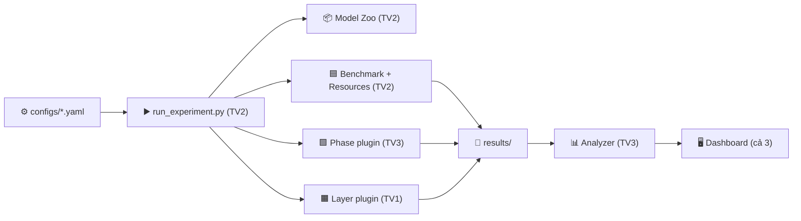
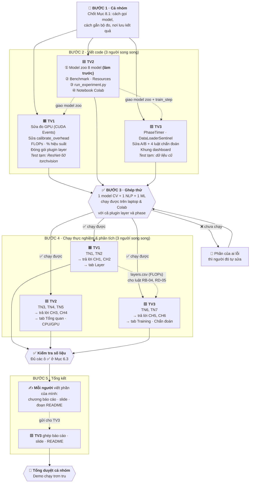

# 🔬 PROJECT PLAN: AI Model Profiling Framework

> **Đề tài:** Xây dựng framework đo và phân tích hiệu năng (profiling) cho các mô hình AI (Computer Vision · NLP · Machine Learning cổ điển) trên CPU và GPU
> **Loại:** Đồ án môn học · **Nhóm:** 3 người (TV1, TV2, TV3) · **Code nền:** VisionProf v1.0 (`src/collector.py`, `src/analyzer.py`, `src/dashboard.py`)

> [!TIP]
> **Đọc nhanh**
> - **Bài toán:** Model AI chạy nhanh/chậm thế nào, tốn bao nhiêu tài nguyên trên CPU và GPU, và **chậm ở đâu**?
> - **Phạm vi:** 8 model (CV, NLP, ML) · 2 loại máy (**laptop CPU** và **GPU Colab T4**) · inference là chính, training là phụ
> - **Chia việc:** mỗi người một **mức đo**, tự làm trọn từ code → chạy → phân tích → trình bày
> - **Làm song song**, chỉ chạm nhau ở vài điểm đã liệt kê rõ (Mục 8.3). **Sơ đồ quy trình ở Mục 8.4**

## 📑 Mục lục

1. [Bài toán & Mục tiêu](#1-bài-toán--mục-tiêu)
2. [Hiện trạng code](#2-hiện-trạng-code)
3. [Phạm vi: Model & Dữ liệu](#3-phạm-vi-model--dữ-liệu)
4. [Phạm vi: Máy đo & Training/Inference](#4-phạm-vi-máy-đo--traininginference)
5. [3 mức đo & Metrics của từng người](#5-3-mức-đo--metrics-của-từng-người)
6. [Câu hỏi nghiên cứu & Thực nghiệm](#6-câu-hỏi-nghiên-cứu--thực-nghiệm)
7. [Phân công chi tiết](#7-phân-công-chi-tiết)
8. [Phối hợp chung](#8-phối-hợp-chung)
9. [Sản phẩm bàn giao](#9-sản-phẩm-bàn-giao)
10. [Rủi ro & Ngoài phạm vi](#10-rủi-ro--ngoài-phạm-vi)

---

## 1. Bài toán & Mục tiêu

### 1.1. Phát biểu bài toán

> **"Cho một mô hình AI, nó chạy nhanh/chậm thế nào, tốn bao nhiêu tài nguyên trên CPU và GPU, và *thời gian/bộ nhớ bị tiêu tốn ở đâu* (layer nào, giai đoạn nào)?"**

Framework cần làm được 4 việc:
- **Đo** hiệu năng ở 3 mức chi tiết: toàn model · từng giai đoạn · từng layer.
- **Chuẩn hoá** kết quả để so sánh được giữa các model và giữa CPU với GPU.
- **Chẩn đoán** tự động điểm nghẽn (bottleneck) bằng bộ luật heuristic.
- **Trực quan hoá** kết quả trên dashboard.

### 1.2. Phân biệt 3 khái niệm (dùng khi trình bày)

| Khái niệm | Trả lời câu hỏi | Ví dụ chỉ số | Project có làm? |
| :--- | :--- | :--- | :---: |
| **Evaluation** | Model đoán *đúng* không? | Accuracy, mAP, F1 | ❌ (chỉ kiểm tra sai lệch output khi dùng FP16) |
| **Benchmarking** | Model chạy *nhanh* và *tốn* bao nhiêu? | Latency P50/P95, FPS, Peak Memory | ✅ |
| **Profiling** | *Tại sao* chậm, chậm *ở đâu*? | Thời gian từng layer, forward/backward, FLOPs | ✅ **(trọng tâm)** |

### 1.3. Mục tiêu cần đạt

| # | Mục tiêu | Tiêu chí đạt |
| :-: | :--- | :--- |
| G1 | Hỗ trợ 3 họ model | Profile được 8 model (CV, NLP, ML) bằng **1 lệnh** |
| G2 | Chạy được cả CPU và GPU | Cùng một cấu hình chạy được trên laptop CPU và Colab T4 |
| G3 | Đo đúng | Sai lệch so với `torch.profiler` **< 10%**; profiler làm model chậm đi **< 5%** |
| G4 | Phân tích có chiều sâu | Trả lời được 6 câu hỏi nghiên cứu (Mục 6) bằng số liệu |
| G5 | Trình bày được | Dashboard + báo cáo + slide + demo trực tiếp |

---

## 2. Hiện trạng code

| Thành phần | File | Trạng thái | Ai sửa |
| :--- | :--- | :--- | :-: |
| `LayerProfiler`: hook đo từng layer | `collector.py` | ⚠️ Đúng trên CPU, **sai trên GPU** (dùng đồng hồ CPU) | TV1 |
| `calibrate_overhead` | `collector.py` | ⚠️ Đếm sai số layer có gắn hook | TV1 |
| `DataLoaderSentinel`: đo thời gian nạp dữ liệu | `collector.py` | ⚠️ Dùng được, nhưng bỏ sót batch đầu tiên | TV3 |
| `RuleCatalog`: 19 luật chẩn đoán | `analyzer.py` | ⚠️ 4 luật sai logic: RB-04, RD-02, RD-05, RC-03 | TV3 |
| `ABComparisonEngine`: so sánh 2 model | `analyzer.py` | ⚠️ Speedup tính sai (lấy trung bình các layer) | TV3 |
| Dashboard 5 tab (Streamlit) | `dashboard.py` | ✅ Dùng được, cần thêm tab | Cả 3 |
| Benchmark 5 model CV trên CPU | `tests/` | ✅ Kết quả cũ trong `data/profiles/` | — |

**Còn thiếu:** NLP và ML cổ điển · đo training (forward / backward / optimizer) · P50/P95/P99 và throughput · FLOPs · ghi thông tin máy · kiểm chứng độ chính xác của công cụ đo.

---

## 3. Phạm vi: Model & Dữ liệu

### 3.1. 8 model chính

| Họ | Model | Params | Input | Vì sao chọn | Nguồn |
| :--- | :--- | :-: | :--- | :--- | :--- |
| **CV** | MobileNetV3-Large | 5.5M | `3×224×224` | CNN nhẹ cho thiết bị yếu | `torchvision` |
| | ResNet-50 | 25.6M | `3×224×224` | CNN kinh điển, làm mốc so sánh | `torchvision` |
| | ViT-B/16 | 86.6M | `3×224×224` | Transformer cho ảnh | `torchvision` |
| | YOLOv8n | 3.2M | `3×640×640` | Nhận diện vật thể, có tiền/hậu xử lý (NMS) | `ultralytics` |
| **NLP** | DistilBERT | 66M | 128 token | BERT "rút gọn" (6 layer), so sánh cặp với BERT | `transformers` |
| | BERT-base | 110M | 128 token | Transformer NLP chuẩn (12 layer) | `transformers` |
| **ML** | MLP | ~0.1M | 54 đặc trưng | Model nhỏ: chi phí framework lớn hơn phần tính toán | Tự viết |
| | XGBoost | — | Covertype | Mô hình cây, không phải neural net, chạy được CPU & GPU | `xgboost` |

**Bonus (nếu dư sức):**
- YOLOv11n: tái hiện "YOLO Paradox", tức ít tham số hơn YOLOv8n nhưng chạy chậm hơn trên CPU.
- ConvNeXt-Tiny: đã có số liệu CPU cũ.
- GPT-2: đo độ trễ sinh từng token.

### 3.2. Dữ liệu

| Họ | Để đo tốc độ | Để đo training / quy trình thật |
| :--- | :--- | :--- |
| CV | Tensor ngẫu nhiên, kích thước cố định | CIFAR-10 (resize 224) · 100 ảnh COCO cho YOLO |
| NLP | Token ngẫu nhiên, độ dài cố định | SST-2 (qua thư viện HF `datasets`) |
| ML | Covertype (`sklearn.datasets.fetch_covtype`) | Covertype (chia train/test) |

> 📌 **Không cần train tới hội tụ.** Chỉ chạy vài chục vòng để đo hiệu năng.

---

## 4. Phạm vi: Máy đo & Training/Inference

### 4.1. 2 loại máy

| Máy | Thiết bị | Ai dùng | Vai trò |
| :--- | :--- | :--- | :--- |
| 💻 **Laptop CPU** | Intel/AMD, mỗi người dùng laptop của mình | Cả 3 | Đại diện máy cá nhân / thiết bị biên |
| ☁️ **Colab T4** | GPU Tesla T4 16GB (có Tensor Core) | Cả 3, **mỗi người dùng tài khoản riêng** | GPU duy nhất của nhóm |

> 📌 Mỗi thực nghiệm lấy toàn bộ số liệu CPU từ **đúng 1 laptop** (laptop của người phụ trách thực nghiệm đó), để các model trong thực nghiệm so sánh được với nhau.

### 4.2. Inference vs Training

| | **Inference (trọng tâm, ~70%)** | **Training (phụ, ~30%)** |
| :--- | :--- | :--- |
| Chế độ | `model.eval()` + `torch.inference_mode()` | `model.train()`, optimizer AdamW |
| Đo gì | Đủ cả 3 mức: Layer, Model, Giai đoạn | Chỉ mức Giai đoạn: nạp dữ liệu → forward → backward → optimizer. **Không đo từng layer.** |
| Ai đo | TV1, TV2, TV3 (tiền/hậu xử lý) | **Chỉ TV3** |
| Số vòng | Khởi động 10 + đo 50 | Khởi động 5 + đo 30 |
| Model | Cả 8 | ResNet-50, MobileNetV3, DistilBERT, MLP, XGBoost `fit` |

---

## 5. 3 mức đo & Metrics của từng người

Ba mức giống **3 độ zoom khi nhìn cùng một model**. Đây **không phải thứ tự làm**: 3 mức được làm song song, mỗi người phụ trách một mức.

| Mức | Nhìn vào đâu | Áp dụng cho | Kỹ thuật đo | Ai |
| :--- | :--- | :--- | :--- | :-: |
| 🟧 **Layer** | Bên trong model | Model PyTorch (CV, NLP, MLP) | Forward hook · CPU: `perf_counter_ns` · GPU: `torch.cuda.Event`, đồng bộ 1 lần cuối | **TV1** |
| 🟦 **Model** | Toàn bộ model | Cả 8 model (kể cả XGBoost) | Bấm giờ bao ngoài + đồng bộ GPU; luồng nền lấy mẫu tài nguyên | **TV2** |
| 🟩 **Giai đoạn** | Từng bước xử lý | Cả 8 model | Context manager đánh dấu từng giai đoạn | **TV3** |

### 5.1. 🟧 Metrics của TV1: Mức Layer *(7 metric, ghi vào `layers.csv`)*

| # | Metric | Đơn vị | Nghĩa là gì | Công cụ |
| :-: | :--- | :-: | :--- | :--- |
| 1 | Thời gian từng layer | ms | Mỗi layer chạy mất bao lâu → ra **top-10 layer chậm nhất** | Hook + `perf_counter_ns` / CUDA Events |
| 2 | Tỷ trọng theo loại layer | % | Gộp Conv, BatchNorm, ReLU, Linear… xem loại nào tốn nhất | Cộng dồn từ metric 1 |
| 3 | Bộ nhớ output từng layer | MB | Kết quả mỗi layer sinh ra chiếm bao nhiêu bộ nhớ | `numel × element_size` |
| 4 | FLOPs từng layer & toàn model | GFLOPs | Layer phải làm bao nhiêu phép tính | `torch.utils.flop_counter.FlopCounterMode` |
| 5 | Hiệu suất đạt được | % | Layer tận dụng được bao nhiêu % sức tối đa của máy | FLOPs / thời gian, so với thông số CPU laptop & T4 |
| 6 | Overhead của profiler | % | Gắn công cụ đo vào làm model chậm đi bao nhiêu | Chạy có hook so với không hook |
| 7 | Thời gian không thuộc layer nào | % | Phần hook bỏ sót (`torch.cat`, `x + y`…) | Tổng thời gian − Σ các layer |

### 5.2. 🟦 Metrics của TV2: Mức Model *(12 metric, ghi vào `summary.json`, `benchmark.csv`, `resources.csv`)*

| # | Metric | Đơn vị | Nghĩa là gì | Công cụ |
| :-: | :--- | :-: | :--- | :--- |
| 1 | Mean / Std latency | ms | Thời gian chạy trung bình và độ dao động | `time.perf_counter` |
| 2 | **P50 / P90 / P95 / P99** latency | ms | 50%, 90%, 95%, 99% số lần chạy nhanh hơn mức này | `numpy.percentile` |
| 3 | Tail ratio = P99 / P50 | × | Model chạy có ổn định không, có bị "giật" không | Tính từ metric 2 |
| 4 | Throughput | mẫu/s | Mỗi giây xử lý được bao nhiêu ảnh / câu / dòng | `batch × 1000 / mean_ms` |
| 5 | Cold-start | ms | Lần chạy đầu tiên chậm hơn bình thường bao nhiêu | Vòng đầu tiên |
| 6 | Peak VRAM | MB | Bộ nhớ GPU dùng nhiều nhất | `torch.cuda.max_memory_allocated` |
| 7 | RAM của chương trình (RSS) | MB | Bộ nhớ máy tính mà chương trình chiếm | `psutil` |
| 8 | Params | M | Số tham số của model | `sum(p.numel())` |
| 9 | CPU %, GPU %, VRAM đang dùng | %, MB | Phần cứng được dùng bao nhiêu trong lúc chạy | `psutil`, `pynvml` (luồng nền 100ms) |
| 10 | Công suất GPU *(nếu đọc được)* | W | GPU tiêu thụ bao nhiêu điện | `pynvml` |
| 11 | Cosine similarity FP32 so với FP16 | — | Dùng FP16 thì kết quả có bị lệch không | So output của 2 cấu hình |
| 12 | XGBoost `predict` | ms, dòng/s | Độ trễ khi dự đoán 1 dòng và 10.000 dòng; tốc độ theo `n_jobs` = 1 / 2 / 4 / tất cả; CPU so với GPU | `time.perf_counter` |

### 5.3. 🟩 Metrics của TV3: Mức Giai đoạn *(7 metric, ghi vào `phases.csv`)*

| # | Metric | Đơn vị | Nghĩa là gì | Công cụ |
| :-: | :--- | :-: | :--- | :--- |
| 1 | Thời gian từng giai đoạn inference | ms, % | Tiền xử lý / model / hậu xử lý mỗi bước bao lâu | Phase timer |
| 2 | % thời gian ngoài model | % | (tiền xử lý + hậu xử lý) / tổng | Tính từ metric 1 |
| 3 | Thời gian từng bước training | ms, % | Nạp dữ liệu / forward / backward / optimizer | Phase timer |
| 4 | Tỷ lệ backward / forward | × | Backward tốn gấp mấy lần forward | Tính từ metric 3 |
| 5 | Bộ nhớ training / inference | × | Train tốn bộ nhớ gấp mấy lần inference (đo cả 2 trong cùng TN6) | `torch.cuda.max_memory_allocated` |
| 6 | Tỷ lệ I/O | % | Nạp dữ liệu chiếm bao nhiêu % một bước (cao nghĩa là GPU đang phải chờ) | `DataLoaderSentinel` |
| 7 | XGBoost `fit` | s | Thời gian train XGBoost trên CPU so với GPU | `time.perf_counter` |

---

## 6. Câu hỏi nghiên cứu & Thực nghiệm

**Câu hỏi (CH)** là điều báo cáo phải trả lời. **Thực nghiệm (TN)** là việc chạy máy để lấy số liệu trả lời câu hỏi đó. Mỗi câu hỏi có một **kỳ vọng**, tức lời đoán trước. Thực nghiệm dùng để kiểm tra lời đoán đó đúng hay sai.

### 6.1. 6 câu hỏi

| Ai | Câu hỏi | Thực nghiệm | Kỳ vọng |
| :-: | :--- | :--- | :--- |
| **TV1** | **CH1.** Thời gian tốn nhiều nhất ở **loại layer nào**? CPU và GPU khác nhau ra sao? | **TN1** | Trên CPU, Conv/Linear chiếm phần lớn. Trên GPU, tỷ trọng các layer nhỏ (Norm, Activation) tăng lên |
| | **CH2.** Công cụ của nhóm **đo có đúng không**, và làm model chậm đi bao nhiêu? | **TN2** | Sai lệch < 10% so với `torch.profiler`, làm chậm < 5% |
| **TV2** | **CH3.** Model ít tham số có chắc **chạy nhanh hơn**? Chuyển từ CPU sang GPU thì **thứ hạng có đảo** không? | **TN3** | Có đảo. Model nhiều layer nhỏ (MobileNet, YOLO) ít hưởng lợi từ GPU, còn ViT/BERT hưởng lợi nhiều nhất |
| | **CH4.** **Tăng batch** hoặc dùng **FP16** thì nhanh thêm bao nhiêu? | **TN4, TN5** | GPU tăng tốc mạnh khi batch lớn, CPU gần như không. FP16 trên T4 nhanh rõ rệt nhờ Tensor Core, kết quả gần như không lệch |
| **TV3** | **CH5.** Khi **training**, backward tốn gấp mấy lần forward? Bộ nhớ tăng bao nhiêu? Nạp dữ liệu có làm GPU phải chờ? | **TN6** | Backward ≈ 2× forward; bộ nhớ gấp 2–4× inference; `num_workers=0` gây nghẽn |
| | **CH6.** Trong ứng dụng thật, **ngoài model** (tiền xử lý, NMS, tokenize) chiếm bao nhiêu %? | **TN7** | Với YOLO batch 1 trên GPU, tiền xử lý + hậu xử lý chiếm > 30% |

### 6.2. 7 thực nghiệm

| TN | Tên | Thay đổi gì | Model | Kết quả chính |
| :-: | :--- | :--- | :--- | :--- |
| **TN1** | Phân rã theo layer | CPU so với GPU | 7 model PyTorch (trừ XGBoost) | Top-10 layer chậm nhất (bảng CPU và GPU đặt cạnh nhau), tỷ trọng theo loại layer |
| **TN2** | Kiểm chứng công cụ | Có hook / không hook; so với `torch.profiler` | ResNet-50, BERT-base | % overhead, % sai lệch |
| **TN3** | So sánh cơ bản | CPU so với GPU, batch 1 | Cả 8 | Bảng latency, throughput, bộ nhớ của 8 model × 2 máy |
| **TN4** | Tăng batch | batch 1 / 8 / 32 (NLP thêm độ dài 64 / 128 / 256) | Cả 8 | Đường throughput theo batch, điểm bão hoà |
| **TN5** | Độ chính xác số | FP32 so với FP16 trên T4 | CV + NLP | Mức tăng tốc, bộ nhớ giảm, cosine similarity |
| **TN6** | Một bước training | CPU so với GPU; `num_workers` = 0 / 2 / 4 | 5 model ở Mục 4.2 | Biểu đồ cột: nạp dữ liệu / forward / backward / optimizer; bộ nhớ train so với infer |
| **TN7** | Quy trình thật | CPU so với GPU | YOLO (đọc ảnh → resize → model → NMS), BERT (tokenize → model), XGBoost (đọc CSV → predict) | % thời gian từng giai đoạn |

### 6.3. Chạy trên máy nào

| TN | Ai | 💻 Laptop CPU | ☁️ Colab T4 |
| :-: | :-: | :-: | :-: |
| TN1 | TV1 | ✅ laptop TV1 | ✅ |
| TN2 | TV1 | ✅ laptop TV1 | ✅ |
| TN3 | TV2 | ✅ laptop TV2 | ✅ |
| TN4 | TV2 | ✅ laptop TV2 | ✅ |
| TN5 | TV2 | — *(FP16 chỉ có lợi trên GPU)* | ✅ |
| TN6 | TV3 | ✅ laptop TV3 (model nhỏ) | ✅ |
| TN7 | TV3 | ✅ laptop TV3 | ✅ |

### 6.4. Quy tắc đo chung

1. **Khởi động** 10 vòng (training: 5) và không tính các vòng này, rồi **đo** 50 vòng (training: 30).
2. **GPU:** gọi `torch.cuda.synchronize()` trước khi bấm giờ; bật `cudnn.benchmark = True`.
3. **Laptop:** cắm sạc, bật chế độ hiệu năng cao, tắt app nặng, cố định `torch.set_num_threads()`.
4. **So 2 model:** chạy **xen kẽ** A-B-A-B để máy nóng lên không làm lệch kết quả.
5. Cố định seed và kích thước input. Mỗi lần chạy **tự lưu thông tin máy** (CPU, GPU, RAM, phiên bản thư viện).

---

## 7. Phân công chi tiết

**Nguyên tắc:** mỗi người **sở hữu trọn một mức đo**: tự viết công cụ → tự chạy → tự phân tích → tự làm tab dashboard → tự viết chương báo cáo → tự trình bày. Không ai phải trình bày kết quả đo bằng công cụ của người khác.

| | 👤 **TV1: Mức Layer** | 👤 **TV2: Mức Model** | 👤 **TV3: Mức Giai đoạn + Tổng kết** |
| :--- | :--- | :--- | :--- |
| **Metrics** | 7 (Mục 5.1) | 12 (Mục 5.2) | 7 (Mục 5.3) |
| **Trả lời** | CH1, CH2 | CH3, CH4 | CH5, CH6 |
| **Chạy** | TN1, TN2 | TN3, TN4, TN5 | TN6, TN7 |
| **File sở hữu** | `collector.py`, `flops.py`, `hw_specs.py` | `zoo/`, `benchmark.py`, `resources.py`, `run_experiment.py`, `notebooks/` | `phases.py`, `analyzer.py`, `dashboard/` |
| **Máy** | Laptop TV1 · Colab | Laptop TV2 · Colab | Laptop TV3 · Colab |
| **Tab dashboard** | Layer · Hiệu suất phần cứng | Tổng quan · So sánh CPU/GPU | Chẩn đoán · A/B · DataLoader · Training & Pipeline |

### 👤 TV1: Mức Layer & Độ chính xác

> **Trình bày:** "Framework mổ xẻ từng layer thế nào, và đo có đúng không" + demo gắn profiler vào model.

- **Code**
  - [ ] Sửa đo GPU: dùng `torch.cuda.Event`, chỉ đồng bộ 1 lần sau khi chạy xong model; dùng stack cho module được gọi nhiều lần (phát triển và test phần GPU trên Colab)
  - [ ] Sửa `calibrate_overhead` (đếm đúng số layer có hook)
  - [ ] Tách bộ nhớ output của từng layer khỏi RAM của cả chương trình
  - [ ] Tính FLOPs từng layer và toàn model bằng `FlopCounterMode`; lập bảng thông số tối đa của CPU laptop và T4 để tính % hiệu suất
  - [ ] Đóng gói thành plugin `layer` (Mục 8.1)
- **Chạy & phân tích:** TN1, TN2 → CH1, CH2
- **Báo cáo:** kiến thức nền (hook, CUDA Events, FLOPs) · công cụ liên quan (`torch.profiler`, Nsight) · thiết kế mức Layer · kết quả CH1–CH2 · kiểm chứng độ chính xác

### 👤 TV2: Mức Model & So sánh CPU/GPU

> **Trình bày:** "8 model trên CPU và GPU: model nào nhanh nhất, và vì sao thứ hạng thay đổi".

- **Code**
  - [ ] Nạp 8 model qua một cách gọi chung (kèm letterbox + NMS cho YOLO, tokenizer cho BERT, hàm `train_step` cho TV3 dùng)
  - [ ] Đo toàn model: P50/P90/P95/P99, throughput, bộ nhớ đỉnh
  - [ ] Luồng nền theo dõi CPU %, RAM, GPU %, VRAM (mỗi 100ms) + tự ghi thông tin máy
  - [ ] Script chạy chung: `run_experiment.py --model resnet50 --exp TN3 --device cuda --profilers layer,phase`, có cờ `--skip-existing`
  - [ ] Notebook Colab: clone repo → cài thư viện → chạy → nén `results/`
- **Chạy & phân tích:** TN3, TN4, TN5 → CH3, CH4
- **Báo cáo:** kiến trúc tổng · thiết kế mức Model · thiết lập thực nghiệm (model, máy, quy tắc đo) · kết quả CH3–CH4
- *Bonus:* YOLOv11n, ConvNeXt-Tiny, GPT-2

### 👤 TV3: Mức Giai đoạn · Training, Pipeline, Chẩn đoán & Tổng kết

> **Trình bày:** mở đầu + "training và quy trình thật tốn thời gian ở đâu" + demo dashboard + kết luận.

- **Code**
  - [ ] Bộ đo giai đoạn `with t.phase("backward"):` (có đồng bộ GPU), đóng gói thành plugin `phase`
  - [ ] Chuyển `DataLoaderSentinel` sang `phases.py`, sửa lỗi bỏ sót batch đầu tiên
  - [ ] Sửa so sánh A/B (tính speedup trên tổng thời gian model mỗi vòng)
  - [ ] Sửa 4 luật chẩn đoán: RB-04, RD-05 (đổi ms/Mparam → ms/GFLOP, **đọc FLOPs từ `layers.csv` của TV1**), RD-02 (bỏ nhãn "dead layer"), RC-03
  - [ ] Tách dashboard thành khung `app.py` + thư mục `tabs/` (mỗi người 1 file tab)
- **Chạy & phân tích:** TN6, TN7 → CH5, CH6
- **Tổng kết**
  - [ ] Ghép báo cáo + slide (nội dung từng phần do chủ phần đó viết)
  - [ ] Viết **README tổng**: giới thiệu, cài đặt, cách chạy, tóm tắt kết quả (mỗi người gửi đoạn hướng dẫn phần code của mình)
- **Báo cáo:** giới thiệu & bài toán · thiết kế mức Giai đoạn & heuristic · kết quả CH5–CH6 · kết luận
- *Bonus:* đo backward từng layer (`register_full_backward_hook`)

---

## 8. Phối hợp chung

### 8.1. Chốt trước khi code (cả nhóm, 1 lần)

**① Cách gọi model:** TV2 viết, TV1 và TV3 dùng.

```python
class ModelAdapter:
    name: str          # "resnet50", "bert_base", "xgboost"...
    family: str        # "cv" | "nlp" | "ml"
    is_torch: bool     # False với XGBoost → bỏ qua mức Layer

    def load(self, device, precision="fp32"): ...
    def make_input(self, batch_size, **kw): ...        # seq_len cho NLP, img_size cho CV
    def forward(self, model, inputs): ...
    def train_step(self, model, batch, optimizer): ... # TV3 dùng cho TN6
    def preprocess(self, raw) / postprocess(self, out): ...  # TV3 dùng cho TN7
```

**② Cách gắn bộ đo:** TV1 viết plugin `layer`, TV3 viết plugin `phase`. Script của TV2 gọi cả hai.

```python
class ProfilerPlugin:
    name: str                       # "layer" (TV1) | "phase" (TV3)
    def attach(self, model, device): ...
    def start(self, iteration): ...
    def stop(self): ...
    def save(self, out_dir): ...    # ghi layers.csv (TV1) hoặc phases.csv (TV3)
```

**③ Nơi lưu kết quả:** mỗi file chỉ có 1 người ghi.

```
results/{máy}/{model}/{TN}/{cấu_hình}/
├── env.json          # TV2 · thông tin máy + phiên bản thư viện
├── config.json       # TV2 · model, batch, độ dài câu, FP32/FP16, thiết bị
├── benchmark.csv     # TV2 · vòng, latency_ms
├── summary.json      # TV2 · mean, p50, p90, p95, p99, throughput, bộ nhớ đỉnh
├── resources.csv     # TV2 · thời điểm, cpu %, ram, gpu %, vram, công suất
├── layers.csv        # TV1 · vòng, tên layer, loại, thời gian, bộ nhớ, flops, params
└── phases.csv        # TV3 · vòng, giai đoạn, thời gian
```

Tên máy: `cpu_laptop`, `colab_t4` · thời gian tính bằng **ms** · bộ nhớ tính bằng **MB**.

### 8.2. Kiến trúc & thư mục



```
VisionProf/
├── configs/                  # TV2 · file YAML cấu hình model + thực nghiệm
├── src/
│   ├── collector.py          # TV1 · LayerProfiler, calibrate_overhead
│   ├── flops.py, hw_specs.py # TV1 · FLOPs, thông số tối đa của CPU laptop & T4
│   ├── zoo/                  # TV2 · cv.py, nlp.py, tabular.py
│   ├── benchmark.py          # TV2 · đo toàn model
│   ├── resources.py          # TV2 · theo dõi tài nguyên + thông tin máy
│   ├── phases.py             # TV3 · PhaseTimer + DataLoaderSentinel
│   ├── analyzer.py           # TV3 · luật chẩn đoán + so sánh A/B
│   └── dashboard/            # TV3 làm app.py · tabs/ mỗi người 1 file
├── scripts/run_experiment.py # TV2
├── notebooks/                # TV2 · notebook Colab
└── results/                  # kết quả theo từng máy
```

### 8.3. Các điểm chạm giữa 3 người

3 người làm **song song**, không phải "TV1 xong rồi mới tới TV2". Ngoài các điểm chạm dưới đây, **không ai phải làm lại hay sửa phần của người khác**.

| # | Điểm chạm | Ai với ai | Khi nào | Chỉ cần làm gì |
| :-: | :--- | :--- | :--- | :--- |
| 1 | Chốt Mục 8.1 | Cả 3 | Đầu dự án, 1 lần | Ngồi thống nhất tên hàm, tên cột, thư mục |
| 2 | Dùng model & script chạy của TV2 | TV1, TV3 **dùng** code TV2 | Khi chạy thực nghiệm thật | TV2 cần xong **model zoo trước**. Trong lúc chờ, TV1 test trên ResNet-50 của `torchvision`, TV3 test trên dữ liệu cũ |
| 3 | TV3 đọc FLOPs của TV1 | TV3 **đọc** `layers.csv` | Khi sửa luật RB-04, RD-05 | Chỉ đọc file, không sửa code của TV1 |
| 4 | Ghép thử | Cả 3 | Sau khi code xong | 1 model CV + 1 NLP + 1 ML chạy được trên laptop và Colab, với cả 2 plugin |
| 5 | Review code chéo | TV1 → TV2 → TV3 → TV1 | Mỗi lần merge | Đọc Pull Request của người kế tiếp |
| 6 | Gửi phần tổng kết | TV1, TV2 **gửi** cho TV3 | Cuối dự án | Gửi chương báo cáo, slide, đoạn README của mình |

### 8.4. Quy trình làm việc

**Cách đọc sơ đồ:**
- Mũi tên liền (──▶) là đi tiếp sang bước sau.
- Mũi tên nét đứt (╌╌▶) là **bàn giao** giữa 2 người.
- Hình lục giác là **điểm kiểm tra**: phải đạt mới được qua bước tiếp theo.



**Bảng tóm tắt từng bước:**

| Bước | Việc | Ai | Điều kiện xong |
| :-: | :--- | :-: | :--- |
| 1 | Chốt Mục 8.1 | Cả nhóm | Commit vào repo |
| 2 | Code phần của mình (TV2 ưu tiên làm xong model zoo trước) | Song song | Mỗi phần chạy được riêng |
| 3 | Ghép thử | Cả nhóm | Chạy được trên laptop và Colab |
| 4 | Chạy thực nghiệm & phân tích phần mình | Song song | Đủ số liệu các ô ✅ ở Mục 6.3 |
| 5 | Ghép báo cáo, slide, README → tổng duyệt | TV3 + cả nhóm | Demo chạy trơn tru |

### 8.5. Quy tắc nhóm

- Mỗi người làm trên **branch riêng**, merge qua Pull Request, **review chéo**.
- **Chỉ sửa file của mình.** Muốn đổi Mục 8.1 thì báo cả nhóm.
- Mỗi câu hỏi trong báo cáo có đủ **1 bảng + 1 biểu đồ + 3–5 câu kết luận**, do chủ phần tự làm.
- Colab giới hạn giờ dùng GPU, nên mỗi người chạy phần mình bằng **tài khoản Colab riêng**.

---

## 9. Sản phẩm bàn giao

| Sản phẩm | Nội dung | Ai |
| :--- | :--- | :-: |
| **Source code** | Framework + script chạy + notebook Colab | Cả 3 |
| **Dữ liệu kết quả** | `results/` của laptop CPU và Colab T4, kèm thông tin máy | Cả 3 |
| **Dashboard** | Streamlit, mỗi người 1–2 tab | Cả 3, TV3 làm khung |
| **README** | Giới thiệu, cài đặt, cách chạy, tóm tắt kết quả | TV3 (mỗi người gửi phần mình) |
| **Báo cáo** (~20–25 trang) | Theo dàn ý bên dưới | Mỗi người phần mình, TV3 ghép |
| **Slide + demo** | Mỗi người trình bày phần mình | Cả 3, TV3 làm khung |

**Dàn ý báo cáo**

| Chương | Nội dung | Ai viết |
| :-: | :--- | :-: |
| 1 | Giới thiệu & bài toán (Evaluation vs Benchmarking vs Profiling) | TV3 |
| 2 | Kiến thức nền: hook PyTorch, CUDA chạy bất đồng bộ & Events, FLOPs, tail latency | TV1 |
| 3 | Công cụ liên quan: `torch.profiler`, Nsight, TensorBoard Profiler, và framework này khác gì | TV1 |
| 4 | Thiết kế framework: kiến trúc tổng (TV2) + từng mức đo (mỗi người mức của mình) | Cả 3 |
| 5 | Thiết lập thực nghiệm: model, máy, quy tắc đo | TV2 |
| 6 | Kết quả & thảo luận: CH1–CH6, mỗi câu hỏi một mục | Mỗi người câu của mình |
| 7 | Hạn chế & hướng phát triển | Mỗi người phần mình |
| 8 | Kết luận | TV3 |

---

## 10. Rủi ro & Ngoài phạm vi

| Rủi ro | Mức | Cách xử lý |
| :--- | :-: | :--- |
| Colab ngắt giữa chừng hoặc hết giờ GPU | Cao | Lưu kết quả sau **mỗi** lần chạy; cờ `--skip-existing` để chạy tiếp; mỗi người dùng tài khoản riêng |
| Số đo trên laptop dao động (nhiệt, pin, app chạy nền) | Cao | Cắm sạc, bật chế độ hiệu năng cao, khởi động 10 vòng, dùng P50 thay vì chỉ dùng trung bình, chạy xen kẽ A-B |
| Hook không bắt được phép tính dạng hàm (`torch.cat`, `x + y`) | TB | Báo cáo phần "thời gian không thuộc layer nào" như một metric, không coi là lỗi |
| 3 phần ghép vào không khớp | TB | Chốt Mục 8.1 **trước khi code** |
| TV2 làm model zoo chậm, TV1 và TV3 phải chờ | TB | TV2 ưu tiên làm model zoo trước; TV1 và TV3 test tạm trên model / dữ liệu có sẵn |
| Khác phiên bản thư viện giữa laptop và Colab | TB | Ghim phiên bản trong `requirements.txt`, lưu phiên bản vào `env.json` |
| Không làm kịp hết | TB | Làm phần bắt buộc trước; nếu thiếu sức thì bỏ TN5 hoặc TN7; bonus để cuối |

**Không làm** (để giữ phạm vi đồ án môn học):
- ❌ GPU cá nhân và Kaggle (chỉ dùng laptop CPU + Colab T4)
- ❌ Kiểm chứng bằng NVIDIA Nsight (dùng `torch.profiler` thay thế)
- ❌ Lưu SQLite / Parquet (dùng CSV + JSON là đủ)
- ❌ Các bài ablation và mục tiêu nộp bài báo MLSys trong tài liệu cũ
- ❌ Training trên nhiều GPU · `torch.compile` · TensorRT
- ❌ LLM lớn (> 1B tham số) · đo accuracy / mAP

---

<p align="center"><i>Tài liệu định hướng chính của dự án. Các file cũ (<code>research_plan_profiling_framework.md</code>, <code>TECHNICAL_SPECIFICATION.md</code>, <code>SYSTEM_AUDIT_REPORT.md</code>) chỉ dùng để tham khảo chi tiết kỹ thuật.</i></p>
