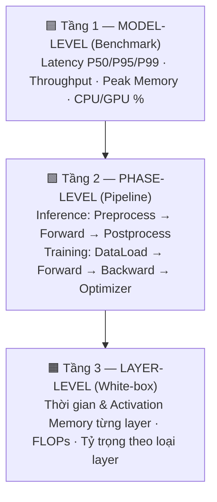
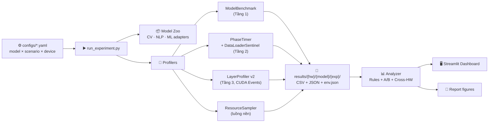
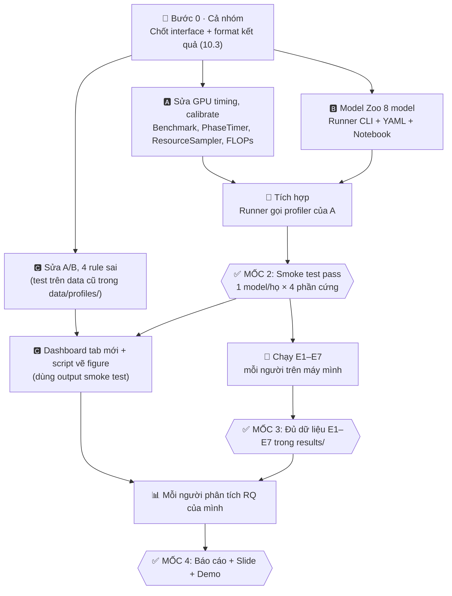

# 🔬 PROJECT PLAN — AI Model Profiling Framework

> **Đề tài:** Xây dựng Framework Profiling đa tầng cho các mô hình AI (Computer Vision · NLP · Machine Learning cổ điển) trên nhiều nền tảng phần cứng CPU/GPU
> **Loại dự án:** Đồ án môn học · **Nhân sự:** 3 người
> **Codebase nền:** VisionProf v1.0 (`src/collector.py`, `src/analyzer.py`, `src/dashboard.py`)
> **Phiên bản plan:** v1.0 — thay thế định hướng "MLSys paper" trong `research_plan_profiling_framework.md`

---

## 📑 Mục lục

1. [Bài toán & Mục tiêu](#1-bài-toán--mục-tiêu)
2. [Hiện trạng codebase](#2-hiện-trạng-codebase)
3. [Phạm vi: Model Zoo](#3-phạm-vi-model-zoo)
4. [Phạm vi: Phần cứng](#4-phạm-vi-phần-cứng)
5. [Phạm vi: Training vs Inference](#5-phạm-vi-training-vs-inference)
6. [Các tầng Profiling & bộ Metrics](#6-các-tầng-profiling--bộ-metrics)
7. [Câu hỏi nghiên cứu](#7-câu-hỏi-nghiên-cứu)
8. [Thiết kế thực nghiệm](#8-thiết-kế-thực-nghiệm)
9. [Kiến trúc Framework & việc cần code](#9-kiến-trúc-framework--việc-cần-code)
10. [Phân công 3 thành viên](#10-phân-công-3-thành-viên)
11. [Sản phẩm bàn giao](#11-sản-phẩm-bàn-giao)
12. [Rủi ro & phương án dự phòng](#12-rủi-ro--phương-án-dự-phòng)
13. [Ngoài phạm vi](#13-ngoài-phạm-vi)

---

## 1. Bài toán & Mục tiêu

### 1.1. Phát biểu bài toán

> **"Cho một mô hình AI bất kỳ, nó chạy nhanh/chậm thế nào, tốn bao nhiêu tài nguyên trên từng loại phần cứng, và *thời gian/bộ nhớ bị tiêu tốn ở đâu* (layer nào, giai đoạn nào)?"**

Project xây dựng một **framework profiling** cho PyTorch và scikit-learn/XGBoost:
- **Đo** hiệu năng ở 3 tầng: toàn model → giai đoạn (phase) → từng layer.
- **Chuẩn hoá** kết quả để so sánh được giữa các model và các phần cứng.
- **Chẩn đoán** tự động nút thắt (bottleneck) bằng bộ luật heuristic.
- **Trực quan hoá** kết quả trên dashboard.

### 1.2. Phân biệt 3 khái niệm (dùng khi trình bày)

| Khái niệm | Trả lời câu hỏi | Ví dụ chỉ số | Project có làm? |
| :--- | :--- | :--- | :---: |
| **Evaluation** | Model đoán *đúng* không? | Accuracy, mAP, F1 | ❌ (chỉ kiểm tra sai lệch output khi dùng FP16) |
| **Benchmarking** | Model chạy *nhanh* và *tốn* bao nhiêu? | Latency P50/P95, FPS, Peak Memory | ✅ |
| **Profiling** | *Tại sao* chậm, chậm *ở đâu*? | Thời gian từng layer, forward/backward, FLOPs | ✅ **(trọng tâm)** |

### 1.3. Mục tiêu đo được (Success Criteria)

| # | Mục tiêu | Tiêu chí đạt |
| :-: | :--- | :--- |
| G1 | Framework hỗ trợ 3 họ model | Profile được ≥ 8 model (CV, NLP, ML) bằng **1 lệnh** |
| G2 | Chạy đa phần cứng | Cùng 1 config chạy được trên CPU, GPU local, Colab, Kaggle |
| G3 | Đo đúng | Sai lệch tổng thời gian layer so với `torch.profiler` **< 10%**; overhead **< 5%** |
| G4 | Có chiều sâu phân tích | Trả lời được 5 câu hỏi nghiên cứu (Mục 7) bằng số liệu |
| G5 | Trình bày được | Dashboard + báo cáo + slide + demo trực tiếp |

---

## 2. Hiện trạng codebase

### 2.1. Đã có (tái sử dụng)

| Thành phần | File | Trạng thái |
| :--- | :--- | :--- |
| `LayerProfiler` (hook forward từng leaf layer) | `src/collector.py` | ✅ Dùng được trên CPU |
| `calibrate_overhead` | `src/collector.py` | ⚠️ Lỗi: mẫu số chỉ đếm layer có tham số |
| `DataLoaderSentinel` (đo I/O vs compute) | `src/collector.py` | ✅ Dùng được, bỏ sót batch 0 |
| `MultiModelProfiler` | `src/collector.py` | ✅ Có thể mở rộng thành runner |
| `RuleCatalog` (19 luật) | `src/analyzer.py` | ⚠️ 4 luật sai logic: RB-04, RD-02, RD-05, RC-03 |
| `ABComparisonEngine` (Mann-Whitney U) | `src/analyzer.py` | ⚠️ Speedup tính sai (chia trung bình layer) |
| Dashboard 5 tab (Streamlit + Plotly) | `src/dashboard.py` | ✅ Dùng được, cần thêm tab |
| Benchmark 5 model CV trên CPU | `tests/test_modern_models_benchmark.py` | ✅ Kết quả trong `data/profiles/` |

### 2.2. Còn thiếu (lý do cần plan này)

- ❌ **Đo GPU sai**: dùng `time.perf_counter()` nên chỉ đo thời gian CPU đẩy lệnh vào hàng đợi, không phải thời gian GPU chạy.
- ❌ **Chỉ có CV**, không có NLP và ML cổ điển.
- ❌ **Chỉ đo forward**: training không tách được forward / backward / optimizer step.
- ❌ **Không có tail latency** (P50/P95/P99) và throughput.
- ❌ **Không có quy trình chạy đa phần cứng**: không lưu thông tin phần cứng, không có config thống nhất.
- ❌ **Không có FLOPs**, nên không so được "hiệu suất tính toán" giữa các phần cứng.
- ❌ Chưa kiểm chứng độ chính xác của profiler với công cụ chuẩn.

---

## 3. Phạm vi: Model Zoo

**8 model chính + 3 model bonus**, chọn sao cho mỗi model đại diện một **kiểu tính toán** khác nhau.

### 3.1. Model chính (bắt buộc)

| # | Model | Họ | Params | Input chuẩn | Vì sao chọn | Nguồn |
| :-: | :--- | :--- | :-: | :--- | :--- | :--- |
| 1 | **MobileNetV3-Large** | CV · CNN nhẹ | 5.5M | `1×3×224×224` | Depthwise conv, tối ưu cho edge | `torchvision` |
| 2 | **ResNet-50** | CV · CNN cổ điển | 25.6M | `1×3×224×224` | Baseline kinh điển, conv dày đặc | `torchvision` |
| 3 | **ViT-B/16** | CV · Transformer | 86.6M | `1×3×224×224` | Self-attention trên ảnh | `torchvision` |
| 4 | **YOLOv8n** | CV · Detection | 3.2M | `1×3×640×640` | Có pre/post-processing (NMS), pipeline thật | `ultralytics` |
| 5 | **DistilBERT-base** | NLP · Encoder | 66M | `seq_len=128` | Bản "nén" của BERT (6 layer) | `transformers` |
| 6 | **BERT-base** | NLP · Encoder | 110M | `seq_len=128` | Transformer NLP chuẩn (12 layer), cặp A/B với DistilBERT | `transformers` |
| 7 | **MLP (tabular)** | ML · Neural | ~0.1M | `batch×54` features | Model nhỏ: overhead framework lớn hơn compute | Tự định nghĩa |
| 8 | **XGBoost** | ML · Tree-based | — | Covertype (581k dòng) | Không phải neural net, profile kiểu black-box, có hỗ trợ GPU | `xgboost` |

### 3.2. Model bonus (làm sau khi xong 8 model chính)

| Model | Lý do |
| :--- | :--- |
| **YOLOv11n** | Tái hiện "YOLO Paradox": ít tham số hơn YOLOv8n nhưng chạy chậm hơn trên CPU (đã có số liệu CPU) |
| **ConvNeXt-Tiny** | CNN hiện đại đối trọng ViT (đã có số liệu CPU) |
| **GPT-2 small** | Decoder sinh văn bản: đo riêng *prefill* và *per-token decode latency* |

### 3.3. Dữ liệu dùng để đo

| Họ | Dữ liệu cho benchmark | Dữ liệu cho training / pipeline |
| :--- | :--- | :--- |
| CV | Tensor ngẫu nhiên, shape cố định | CIFAR-10 (resize 224) · 100 ảnh COCO val2017 cho YOLO pipeline |
| NLP | Token id ngẫu nhiên, `seq_len` cố định | SST-2 (HF `datasets`) cho tokenize + training |
| ML | Covertype (`sklearn.datasets.fetch_covtype`) | Covertype train/test split |

> 📌 **Nguyên tắc:** project **không** cần train model tới hội tụ. Chỉ chạy vài chục iteration để đo hiệu năng.

---

## 4. Phạm vi: Phần cứng

### 4.1. Bốn môi trường đo

| Mã | Môi trường | Thiết bị | Vai trò |
| :-: | :--- | :--- | :--- |
| **HW-1** | Laptop CPU | Intel/AMD x86 (Windows) | Đại diện **edge / máy cá nhân** |
| **HW-2** | GPU local | NVIDIA RTX (consumer) | GPU phổ thông, ổn định, không giới hạn phiên |
| **HW-3** | Google Colab | Tesla **T4** 16GB (Turing, có Tensor Core) | GPU cloud miễn phí phổ biến nhất |
| **HW-4** | Kaggle | Tesla **P100** 16GB (Pascal, **không** Tensor Core) | So với T4: FP16 có còn lợi không khi không có Tensor Core? |

> ⚠️ Kaggle T4×2: chỉ dùng **1 GPU**. Multi-GPU nằm ngoài phạm vi.

### 4.2. Ma trận chạy (không chạy full mọi thứ ở mọi nơi)

| Thực nghiệm | HW-1 CPU | HW-2 GPU local | HW-3 T4 | HW-4 P100 |
| :--- | :-: | :-: | :-: | :-: |
| E1 · Baseline inference | ✅ | ✅ | ✅ | ✅ |
| E2 · Batch / Seq-len scaling | ✅ | ✅ | ✅ | ◻️ |
| E3 · FP32 vs FP16 | ◻️ (INT8 bonus) | ✅ | ✅ | ✅ |
| E4 · Layer-level breakdown | ✅ | ✅ | ✅ | ◻️ |
| E5 · Training step | ✅ (model nhỏ) | ✅ | ✅ | ◻️ |
| E6 · End-to-end pipeline | ✅ | ✅ | ✅ | ◻️ |
| E7 · Kiểm chứng profiler | ✅ | ✅ | ◻️ | ◻️ |

✅ = bắt buộc · ◻️ = tuỳ chọn

### 4.3. Thông tin phần cứng tự động ghi lại mỗi lần chạy

`hostname`, OS, CPU model + số core, RAM, GPU name + VRAM, driver/CUDA version, `torch`/`transformers`/`xgboost` version, thời điểm chạy. Không có thông tin này thì kết quả giữa các máy không so sánh được.

---

## 5. Phạm vi: Training vs Inference

| | **Inference (trọng tâm ~70%)** | **Training (~30%)** |
| :--- | :--- | :--- |
| Chế độ | `model.eval()` + `torch.inference_mode()` | `model.train()`, optimizer AdamW |
| Đo gì | Latency, throughput, memory, layer breakdown, pipeline | **Phân rã 1 training step:** data load → forward → backward → optimizer step |
| Số iteration | warm-up 10 + đo 50 | warm-up 5 + đo 30 step |
| Model áp dụng | Cả 8 model | ResNet-50, ViT-B/16 (hoặc MobileNetV3), DistilBERT, MLP, XGBoost `fit` |
| Câu hỏi chính | "Model nào nhanh nhất trên phần cứng nào?" | "Backward tốn gấp mấy lần forward? Memory training gấp mấy lần inference? DataLoader có làm GPU chờ không?" |

---

## 6. Các tầng Profiling & bộ Metrics

### 6.1. Ba tầng profiling



| Tầng | Áp dụng cho | Kỹ thuật đo |
| :--- | :--- | :--- |
| **1. Model-level** | Mọi model (kể cả XGBoost) | `perf_counter` + `cuda.synchronize()` bao ngoài; luồng nền lấy mẫu tài nguyên |
| **2. Phase-level** | Mọi model | Context manager đánh dấu từng giai đoạn |
| **3. Layer-level** | Chỉ model PyTorch (CV, NLP, MLP) | Forward hooks · **CPU:** `perf_counter_ns` · **GPU:** `torch.cuda.Event` + sync 1 lần cuối |

### 6.2. Bảng Metrics đầy đủ

| Nhóm | Metric | Đơn vị | Tầng | Công cụ |
| :--- | :--- | :-: | :-: | :--- |
| ⏱️ **Thời gian** | Mean / Std latency | ms | 1 | `time.perf_counter` |
| | **P50 / P90 / P95 / P99** latency | ms | 1 | `numpy.percentile` |
| | Tail ratio = P99 / P50 | × | 1 | — |
| | Throughput | samples/s (ảnh/s, câu/s, dòng/s) | 1 | `batch × 1000 / mean_ms` |
| | Thời gian từng phase | ms, % | 2 | Phase timer |
| | Thời gian từng layer / loại layer | ms, % | 3 | Hooks + CUDA Events |
| | Cold-start (lần chạy đầu) | ms | 1 | Iteration đầu tiên |
| 💾 **Bộ nhớ** | Peak VRAM (allocated / reserved) | MB | 1 | `torch.cuda.max_memory_allocated` |
| | Process RAM (RSS) | MB | 1 | `psutil` |
| | Activation memory từng layer | MB | 3 | `numel × element_size` từ output |
| | Memory training / inference | × | 1 | So sánh E5 với E1 |
| 🧮 **Tính toán** | FLOPs toàn model & từng layer | GFLOPs | 1, 3 | `torch.utils.flop_counter.FlopCounterMode` |
| | Hiệu suất đạt được | GFLOPS/s, % peak | 1 | FLOPs / latency, so với spec phần cứng |
| | Params | M | 1 | `sum(p.numel())` |
| 🖥️ **Hệ thống** | CPU utilization | % | 1 | `psutil` (luồng nền 100ms) |
| | GPU utilization, VRAM used | %, MB | 1 | `pynvml` (luồng nền) |
| | GPU power *(nếu đọc được)* | W | 1 | `pynvml` |
| 📦 **Dữ liệu** | I/O ratio = load / (load + compute) | % | 2 | `DataLoaderSentinel` |
| ✅ **Chất lượng output** | Cosine similarity FP32 vs FP16 | — | 1 | So output 2 cấu hình |
| 🔧 **Tự kiểm** | Profiler overhead | % | — | Chạy có hook vs không hook |
| | Unattributed time = forward − Σ layer | % | 3 | Phần thời gian các op không nằm trong module (`torch.cat`, `+`…) |

### 6.3. Metric riêng cho ML cổ điển (XGBoost)

`fit_time`, `predict_latency` (batch 1 và batch 10.000), `rows/s`, `peak RAM`, scaling theo `n_jobs ∈ {1, 2, 4, all}`, **CPU vs GPU** (`device="cuda"`).

---

## 7. Câu hỏi nghiên cứu

Báo cáo xoay quanh **5 câu hỏi**, mỗi câu gắn với thực nghiệm cụ thể:

| Mã | Câu hỏi | Thực nghiệm | Kỳ vọng / Giả thuyết |
| :-: | :--- | :--- | :--- |
| **RQ1** | Ít tham số / ít FLOPs có đồng nghĩa chạy nhanh hơn không? Xếp hạng tốc độ có **đảo ngược** khi đổi CPU ↔ GPU không? | E1, E2 | Có. Model nhiều layer nhỏ (MobileNet, YOLO) thiệt trên GPU vì overhead launch kernel; ViT/BERT hưởng lợi GPU nhiều nhất |
| **RQ2** | Thời gian tập trung ở **loại layer nào**, và có dịch chuyển khi đổi phần cứng không? | E4 | CPU: Conv/Linear chiếm đa số. GPU: phần tỷ trọng của Norm/Activation/op nhỏ tăng lên |
| **RQ3** | Khi tăng batch / seq_len, throughput tăng tới đâu thì **bão hoà**? FP16 lợi bao nhiêu trên T4 (có Tensor Core) so với P100? | E2, E3 | GPU bão hoà ở batch lớn, CPU gần như không tăng. FP16 trên T4 nhanh rõ rệt, trên P100 lợi ít hơn |
| **RQ4** | Trong training, **backward** tốn gấp mấy lần forward? Memory tăng bao nhiêu? DataLoader có làm GPU "đói" không? | E5 | Backward ≈ 2× forward; memory training ≈ 2–4× inference; `num_workers=0` gây nghẽn trên GPU |
| **RQ5** | Trong bài toán thực tế, **model forward chiếm bao nhiêu %** tổng thời gian? (preprocess, NMS, tokenize) | E6 | Với YOLO batch 1 trên GPU, pre + post-processing chiếm phần đáng kể (> 30%) |

---

## 8. Thiết kế thực nghiệm

### 8.1. Giao thức đo chung (áp dụng mọi thực nghiệm)

1. **Warm-up:** 10 iteration (training: 5), bỏ không tính.
2. **Đo:** 50 iteration (training: 30), đủ cho P95 và kiểm định Mann-Whitney U.
3. **GPU:** `torch.cuda.synchronize()` trước và sau mỗi iteration; `torch.backends.cudnn.benchmark = True`.
4. **CPU:** cố định `torch.set_num_threads()`, cắm sạc, đóng app nặng.
5. **So sánh A/B:** chạy **xen kẽ** A₁ B₁ A₂ B₂… để tránh sai lệch do máy nóng lên.
6. **Seed cố định**, input shape cố định.
7. Mỗi lần chạy lưu kèm **hardware info + config** (xem mục 4.3).

### 8.2. Danh sách thực nghiệm

| Mã | Tên | Biến thay đổi | Model | Output chính |
| :-: | :--- | :--- | :--- | :--- |
| **E1** | Baseline Inference | Phần cứng (4 HW) | Cả 8 | Bảng latency/throughput/memory 8 model × 4 HW, biểu đồ xếp hạng |
| **E2** | Scaling | CV: `batch ∈ {1, 8, 32}` · NLP: `batch ∈ {1, 8, 32}` × `seq_len ∈ {64, 128, 256}` · ML: `batch ∈ {1, 1k, 10k}` | Cả 8 | Đường cong throughput theo batch, điểm bão hoà |
| **E3** | Precision | FP32 vs FP16 (AMP) trên GPU · *(bonus: INT8 dynamic quant trên CPU cho BERT)* | CV + NLP | Speedup, memory giảm, cosine similarity |
| **E4** | Layer Breakdown | CPU vs GPU | CV + NLP + MLP | Top-10 layer chậm nhất, tỷ trọng theo loại layer, heuristic report |
| **E5** | Training Step | Phần cứng; `num_workers ∈ {0, 2, 4}` | ResNet-50, ViT/MobileNet, DistilBERT, MLP, XGBoost | Stacked bar: load/fwd/bwd/opt; memory train vs infer; I/O ratio |
| **E6** | End-to-End Pipeline | Phần cứng | YOLOv8n (decode + letterbox → forward → NMS), BERT (tokenize → forward → softmax), XGBoost (load CSV → predict) | Stacked bar % thời gian từng phase |
| **E7** | Kiểm chứng Profiler | Có hook vs không hook; so với `torch.profiler` | ResNet-50, BERT-base | Overhead %, sai lệch so với `torch.profiler`, unattributed time |

### 8.3. Ước lượng khối lượng chạy

- E1: 8 model × 4 HW = **32 run**
- E2: ~8 model × 3–9 cấu hình × 3 HW ≈ **120 run**
- Các thực nghiệm còn lại: ≈ **60 run**
- Mỗi run 1–3 phút, tổng ≈ **6–8 giờ máy**, chia đều cho các môi trường.

---

## 9. Kiến trúc Framework & việc cần code

### 9.1. Kiến trúc đích



### 9.2. Cấu trúc thư mục đề xuất

```
VisionProf/
├── configs/                  # YAML: models.yaml, experiments.yaml
├── src/
│   ├── collector.py          # (sửa) LayerProfiler v2, calibrate_overhead
│   ├── benchmark.py          # (mới) ModelBenchmark: latency dist, throughput
│   ├── phases.py             # (mới) PhaseTimer: pipeline + training step
│   ├── resources.py          # (mới) ResourceSampler + get_env_info()
│   ├── flops.py              # (mới) FLOPs qua FlopCounterMode
│   ├── zoo/                  # (mới) cv.py, nlp.py, tabular.py
│   ├── analyzer.py           # (sửa) fix rules + A/B + cross-hardware
│   └── dashboard.py          # (sửa) thêm tab
├── scripts/run_experiment.py # (mới) CLI: --model --exp --device
├── notebooks/                # (mới) colab_runner.ipynb, kaggle_runner.ipynb
├── results/                  # kết quả thô theo phần cứng
└── tests/
```

### 9.3. Backlog kỹ thuật (MoSCoW)

#### 🔴 MUST: không có thì không ra kết quả

| ID | Việc | File | Ghi chú |
| :-: | :--- | :--- | :--- |
| M1 | Đo GPU đúng: `torch.cuda.Event` trong hook, sync 1 lần cuối forward | `collector.py` | Sửa `_make_hooks`; dùng stack cho module gọi nhiều lần |
| M2 | Sửa `calibrate_overhead`: mẫu số = số layer thực sự có hook | `collector.py` | |
| M3 | `ModelBenchmark`: warm-up, N iter, P50/P90/P95/P99, throughput, peak memory | `benchmark.py` | Dùng cho mọi model |
| M4 | `PhaseTimer`: context manager `with t.phase("forward"):` (có sync GPU) | `phases.py` | Dùng cho pipeline & training step |
| M5 | Model Zoo adapter chung: `load()`, `make_input(batch, ...)`, `preprocess()`, `postprocess()` | `zoo/` | CV, NLP (HF), MLP, XGBoost |
| M6 | `ResourceSampler` (thread 100ms: CPU%, RSS, GPU util, VRAM) + `get_env_info()` | `resources.py` | Bỏ gọi NVML trong hook |
| M7 | Runner CLI + YAML config, lưu `results/{hw}/{model}/{exp}/` | `scripts/` | 1 lệnh chạy được mọi thứ |
| M8 | Notebook Colab/Kaggle: clone repo → cài → chạy runner → zip kết quả | `notebooks/` | |
| M9 | Sửa A/B speedup: tính trên **tổng thời gian model mỗi iteration** | `analyzer.py` | |

#### 🟡 SHOULD: làm để phân tích có chiều sâu

| ID | Việc | Ghi chú |
| :-: | :--- | :--- |
| S1 | FLOPs từng layer & toàn model (`FlopCounterMode`, có sẵn trong PyTorch ≥ 2.1) | Không cần thêm thư viện |
| S2 | Hiệu suất phần cứng = GFLOPS đạt được / peak (bảng spec 4 HW) | "Roofline đơn giản" ở mức model |
| S3 | Sửa 4 luật sai: RB-04 & RD-05 (đổi ms/Mparam → ms/GFLOP), RD-02 (không gọi là "dead layer"), RC-03 | |
| S4 | Tách `process_rss_mb` và `activation_mb` trên CPU | Hết false positive RA-04 |
| S5 | Dashboard: thêm tab **Cross-Hardware** (heatmap model × HW) và **Training Breakdown** | |
| S6 | E7: so sánh tổng thời gian layer với `torch.profiler` | Kiểm chứng G3 |

#### 🟢 COULD: bonus

- Model bonus (YOLOv11n, ConvNeXt-Tiny, GPT-2 decode)
- INT8 dynamic quantization trên CPU cho BERT
- ONNX Runtime black-box benchmark cho 1–2 model
- Backward layer-level (`register_full_backward_hook`)
- Xuất báo cáo HTML tự động

---

## 10. Phân công 3 thành viên

### 10.1. Nguyên tắc chia việc

1. **Chia theo module, không chia theo thực nghiệm.** Mỗi người *sở hữu* một nhóm file riêng nên ít đụng code của nhau và ít conflict git.
2. **Ai cũng code, ai cũng chạy máy, ai cũng viết báo cáo.** Không ai chỉ làm slide, và ai cũng trả lời được khi giảng viên hỏi.
3. **Mỗi người phụ trách 1–2 câu hỏi nghiên cứu (RQ)**: tự phân tích số liệu và viết mục đó trong báo cáo.
4. **Chốt "hợp đồng" chung trước khi code** (Mục 10.3) để 3 phần ghép vào nhau khớp ngay.

### 10.2. Bảng phân công

| | 🅰️ **Thành viên A: Core Profiler** | 🅱️ **Thành viên B: Model Zoo & Experiments** | 🅲 **Thành viên C: Analysis & Presentation** |
| :--- | :--- | :--- | :--- |
| **Vai trò** | Đảm bảo framework **đo đúng** | Đảm bảo **chạy được mọi model trên mọi máy** | Biến số liệu thành **kết luận & hình ảnh** |
| **File sở hữu** | `collector.py`, `benchmark.py`, `phases.py`, `resources.py`, `flops.py` | `zoo/`, `configs/`, `scripts/run_experiment.py`, `notebooks/` | `analyzer.py`, `dashboard.py`, `scripts/make_figures.py` |
| **Backlog** | M1, M2, M3, M4, M6, S1, S4, S6 | M5, M7, M8, model bonus | M9, S2, S3, S5, xuất báo cáo HTML (bonus) |
| **Phần cứng chạy** | HW-2 GPU local *(cần GPU thật để debug CUDA Events)* | HW-3 Colab T4 + HW-4 Kaggle P100 | HW-1 CPU laptop |
| **Thực nghiệm phụ trách** | E4 (layer breakdown), E7 (kiểm chứng) | E1, E2, E3 (điều phối chạy trên cả 4 HW) | E5 (training), E6 (pipeline) |
| **RQ viết báo cáo** | RQ2 | RQ1, RQ3 | RQ4, RQ5 |
| **Chương báo cáo** | Ch.2 Kiến thức nền · Ch.4 Thiết kế · Ch.7 Kiểm chứng | Ch.5 Thiết lập thực nghiệm | Ch.1 Giới thiệu · Ch.3 Công cụ liên quan · Ch.8–9 Kết luận · **ghép báo cáo** |
| **Trình bày** | Demo kỹ thuật: gắn profiler vào model | Kết quả cross-hardware | Mở đầu + dashboard + tổng kết, **lead slide** |

> 💡 Nếu người có GPU local không phải A thì đổi cột "Phần cứng chạy". Người có GPU thật nên giữ HW-2 vì M1 (CUDA Events) cần test trên GPU.

### 10.3. "Hợp đồng" chung: cả 3 chốt trước khi code

**① Interface Model Adapter** (B hiện thực, A và C dùng):

```python
class ModelAdapter:
    name: str                      # "resnet50", "bert_base", "xgboost"...
    family: str                    # "cv" | "nlp" | "ml"
    is_torch: bool                 # False với XGBoost → bỏ qua layer-level

    def load(self, device: str, precision: str = "fp32"): ...
    def make_input(self, batch_size: int, **kw): ...     # seq_len cho NLP, img_size cho CV
    def forward(self, model, inputs): ...                # 1 lần inference
    def train_step(self, model, batch, optimizer): ...   # E5, trả về loss
    def preprocess(self, raw) / postprocess(self, out): ...  # E6
```

**② Cấu trúc & format kết quả** (A ghi ra, C đọc vào):

```
results/{hw_id}/{model}/{exp_id}/{config_tag}/
├── env.json          # thông tin phần cứng + version thư viện
├── config.json       # model, batch, seq_len, precision, device...
├── benchmark.csv     # iteration, latency_ms
├── summary.json      # mean, p50, p90, p95, p99, throughput, peak_mem_mb, flops...
├── layers.csv        # iteration, layer_name, layer_type, time_ms, activation_mb, flops, params
├── phases.csv        # iteration, phase, time_ms
└── resources.csv     # timestamp, cpu_pct, rss_mb, gpu_util_pct, vram_mb, power_w
```

**③ Quy ước chung:** `hw_id` ∈ {`cpu_laptop`, `gpu_local`, `colab_t4`, `kaggle_p100`} · đơn vị thời gian **ms**, bộ nhớ **MB** · tên model viết thường, dùng `_`.

### 10.4. Thứ tự công việc & phụ thuộc

Không gắn mốc thời gian. Đây chỉ là **thứ tự**: bước sau cần kết quả của bước trước.



**Các mốc kiểm tra chung** (cả nhóm họp duyệt khi tới mốc):

| Mốc | Điều kiện đạt |
| :-: | :--- |
| **MK1** | Interface adapter + format `results/` được cả 3 đồng ý (commit vào repo) |
| **MK2** | `run_experiment.py` chạy được ≥ 1 model CV, 1 NLP, 1 ML trên **cả 4 phần cứng**, C đọc được kết quả |
| **MK3** | Đủ dữ liệu E1–E7 (phần bắt buộc ở Mục 4.2) |
| **MK4** | Báo cáo, slide hoàn chỉnh, demo chạy trơn tru |

### 10.5. Checklist từng thành viên

<details open>
<summary><b>🅰️ Thành viên A: Core Profiler</b></summary>

- [ ] M1 · `LayerProfiler` dùng `torch.cuda.Event`, sync 1 lần cuối forward, stack cho module gọi lại nhiều lần
- [ ] M2 · Sửa `calibrate_overhead` (đếm đúng số layer có hook)
- [ ] M3 · `ModelBenchmark`: warm-up, N iter, P50/P90/P95/P99, throughput, peak memory → `benchmark.csv`, `summary.json`
- [ ] M4 · `PhaseTimer` cho pipeline & training step → `phases.csv`
- [ ] M6 · `ResourceSampler` (thread 100ms) + `get_env_info()` → `resources.csv`, `env.json`
- [ ] S1 · FLOPs toàn model & từng layer bằng `FlopCounterMode`
- [ ] S4 · Tách `process_rss_mb` và `activation_mb` trên CPU
- [ ] S6/E7 · So tổng thời gian layer với `torch.profiler`; đo overhead có hook vs không hook
- [ ] Chạy E4 trên GPU local, viết **RQ2** + Ch.2, Ch.4, Ch.7

</details>

<details open>
<summary><b>🅱️ Thành viên B: Model Zoo & Experiments</b></summary>

- [ ] M5 · Adapter CV: MobileNetV3, ResNet-50, ViT-B/16, YOLOv8n (kèm letterbox + NMS)
- [ ] M5 · Adapter NLP: DistilBERT, BERT-base (kèm tokenizer)
- [ ] M5 · Adapter ML: MLP + XGBoost (CPU & `device="cuda"`), dataset Covertype
- [ ] M7 · `run_experiment.py --model --exp --device --hw-id` + YAML config + cờ `--skip-existing`
- [ ] M8 · Notebook Colab & Kaggle: clone → cài → chạy → zip `results/`
- [ ] Chạy E1, E2, E3 trên Colab/Kaggle; gom kết quả 4 HW về repo
- [ ] *(Bonus)* YOLOv11n, ConvNeXt-Tiny, GPT-2 decode
- [ ] Viết **RQ1, RQ3** + Ch.5

</details>

<details open>
<summary><b>🅲 Thành viên C: Analysis & Presentation</b></summary>

- [ ] M9 · Sửa speedup A/B theo tổng thời gian model mỗi iteration
- [ ] S3 · Sửa rule RB-04, RD-05 (→ ms/GFLOP), RD-02 (bỏ "dead layer"), RC-03
- [ ] S2 · Bảng spec peak GFLOPS / bandwidth của 4 HW + tính % hiệu suất
- [ ] S5 · Dashboard: tab **Cross-Hardware** (heatmap model × HW) + tab **Training Breakdown**
- [ ] `make_figures.py`: tự sinh toàn bộ bảng/biểu đồ cho báo cáo từ `results/`
- [ ] Chạy E5, E6 trên CPU laptop (và nhờ A/B chạy phần GPU)
- [ ] Viết **RQ4, RQ5** + Ch.1, Ch.3, Ch.8–9; **ghép báo cáo**, lead slide

</details>

### 10.6. Quy tắc làm việc nhóm

- Mỗi người làm trên **branch riêng**, merge qua Pull Request, **review chéo** (A → B → C → A).
- Kết quả thực nghiệm commit vào `results/{hw_id}/...`: mỗi máy một thư mục nên không conflict.
- Không sửa file của người khác; cần thay đổi interface thì báo cả nhóm.
- Mỗi RQ trong báo cáo có đủ: **≥ 1 bảng + ≥ 1 biểu đồ + kết luận 3–5 câu**.

---

## 11. Sản phẩm bàn giao

| # | Sản phẩm | Mô tả |
| :-: | :--- | :--- |
| D1 | **Source code** | Framework + runner + notebook Colab/Kaggle, README hướng dẫn |
| D2 | **Bộ dữ liệu kết quả** | `results/` gồm CSV/JSON thô của 4 phần cứng + `env.json` |
| D3 | **Dashboard** | Streamlit 7 tab (5 cũ + Cross-Hardware + Training) |
| D4 | **Báo cáo** (~20–25 trang) | Theo dàn ý bên dưới |
| D5 | **Slide** (~15–20 slide) + **demo** | Demo: profile 1 model trực tiếp → xem dashboard |

### Dàn ý báo cáo

1. Giới thiệu & bài toán (Evaluation vs Benchmarking vs Profiling)
2. Kiến thức nền: hooks PyTorch, CUDA async & Events, FLOPs, tail latency, CPU vs GPU
3. Công cụ liên quan: `torch.profiler`, Nsight, TensorBoard Profiler (ưu/nhược, framework này khác ở đâu)
4. Thiết kế framework (3 tầng, kiến trúc, heuristic rules)
5. Thiết lập thực nghiệm (model zoo, phần cứng, giao thức đo)
6. Kết quả & thảo luận, **mỗi RQ một mục**
7. Kiểm chứng độ chính xác & overhead (E7)
8. Hạn chế & hướng phát triển
9. Kết luận

---

## 12. Rủi ro & phương án dự phòng

| Rủi ro | Mức | Phương án |
| :--- | :-: | :--- |
| Colab/Kaggle ngắt phiên giữa chừng | Cao | Runner lưu kết quả **sau mỗi run**; có cờ `--skip-existing` để chạy tiếp |
| Kết quả CPU laptop dao động (nhiệt, pin, app nền) | Cao | Cắm sạc, chế độ High Performance, warm-up 10, báo P50 thay vì chỉ mean, chạy xen kẽ A/B |
| Hook không bắt được op dạng hàm (`torch.cat`, `x + y`) | TB | Báo cáo "unattributed time" như một metric, không coi là lỗi |
| Thư viện khác phiên bản giữa các máy | TB | Ghim version trong `requirements.txt`, lưu version vào `env.json` |
| Khối lượng vượt khả năng nhóm | TB | Làm hết MUST trước; nếu thiếu sức thì bỏ HW-4 hoặc bớt E3/E6; bonus chỉ làm khi E1–E7 đã xong |
| Các phần của 3 người không khớp nhau khi ghép | TB | Chốt **format kết quả** (tên cột CSV, cấu trúc `results/`) và **interface adapter** ngay từ đầu (Mục 10.3) |
| Model lớn chạy CPU quá chậm (ViT, BERT training) | Thấp | Giảm batch/iteration cho training CPU; chỉ train model nhỏ trên CPU |

---

## 13. Ngoài phạm vi

Các mục dưới đây **không làm**, để giữ phạm vi đồ án môn học (các tài liệu cũ có nhắc tới):

- ❌ Kiểm chứng bằng NVIDIA Nsight Systems / Nsight Compute (dùng `torch.profiler` thay thế)
- ❌ Lưu trữ SQLite / Parquet (CSV + JSON là đủ)
- ❌ 7 bài ablation AB-1 → AB-7 và mục tiêu nộp bài báo MLSys
- ❌ Training phân tán / multi-GPU
- ❌ `torch.compile`, TensorRT
- ❌ LLM lớn (> 1B tham số)
- ❌ Đo accuracy / mAP (chỉ đo sai lệch output FP32 vs FP16)

---

<p align="center"><i>Tài liệu định hướng chính của dự án. Các file cũ (<code>research_plan_profiling_framework.md</code>, <code>TECHNICAL_SPECIFICATION.md</code>, <code>SYSTEM_AUDIT_REPORT.md</code>) chỉ dùng để tham khảo chi tiết kỹ thuật.</i></p>
