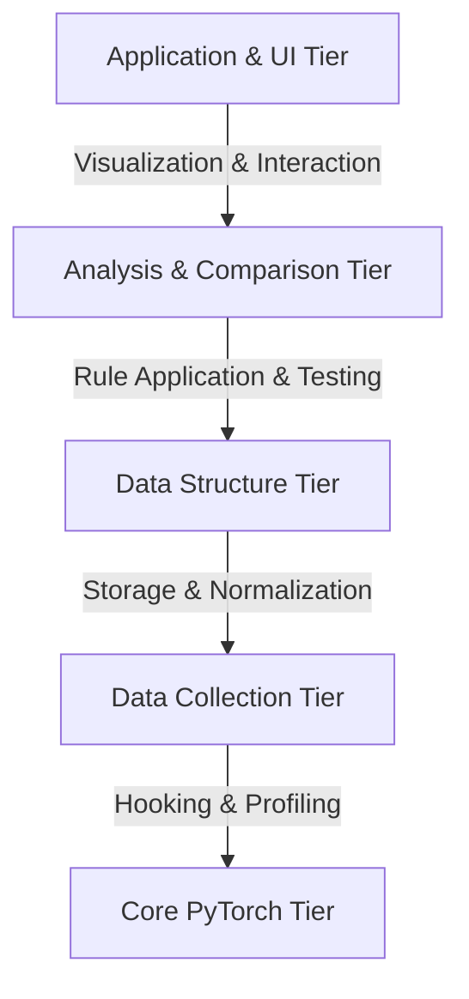

# VisionProf

**Cross-Platform PyTorch Layer Profiler & Automated Heuristic Bottleneck Analyzer**

VisionProf is a comprehensive diagnostic and performance profiling framework specifically designed for cross-platform AI models. The system automatically performs deep layer-by-layer runtime analysis, identifies bottlenecks, and provides actionable recommendations to optimize performance and memory footprint.

## Features
- **`LayerProfiler`**: Utilizes PyTorch Hooks for deep micro-level execution time extraction across all individual layers.
- **`DataLoaderSentinel`**: Monitors and identifies I/O bottlenecks originating from DataLoader misconfigurations.
- **`19 Heuristic Rules`**: An automated heuristic bottleneck analyzer containing 19 rules grouped into 4 categories: Resources (R-A), Speed (R-B), Memory (R-C), and Architecture (R-D).
- **`Cross-Architecture A/B Comparison`**: Built-in engine featuring Mann-Whitney U statistical testing to compare inference efficiency and identify absolute hardware/software advantages.
- **`Streamlit 5-tab Dashboard`**: An interactive UI to visualize performance metrics, layer diagnostics, bottlenecks, A/B comparisons, and health scores.

## Architecture & Project Structure

### 5-Tier Architecture


### Directory Structure
- `src/collector.py`: Contains `LayerProfiler`, `DataLoaderSentinel`, and Overhead Calibration.
- `src/analyzer.py`: Houses the 19 Heuristic Rules and the A/B Comparison Engine.
- `src/dashboard.py`: The Streamlit-based interactive UI with 5 diagnostic tabs.
- `tests/`: Automated test scripts (`test_benchmark.py`, `test_bottleneck.py`).
- `data/` & `reports/`: Extracted JSON profiles and text summaries.

## Experimental Benchmarks (Windows CPU)

### 1. DataLoader Bottleneck Detection
| DataLoader Config | Batch Load Time | Total Runtime Proportion | Health Status |
| :--- | :---: | :---: | :--- |
| `fast_loader` (Optimal) | **1.4 ms** | ~1% | Healthy |
| `slow_loader` (Default) | **171 ms** | ~15-20% | Warning |
| `critical_loader` (Misconfigured) | **646 ms** | **52.3%** | **Bottleneck** |

### 2. Model Benchmark & Health Score
Tested on 5 modern architectures:

| Model | Parameters | Avg Inference Time (ms) | Peak RAM (MB) | Health Score |
| :--- | :---: | :---: | :---: | :---: |
| **MobileNetV3-Large** | 5,483,032 | 239.76 | 22.60 | 95 / 100 |
| **YOLOv8n** | 3,157,200 | 279.34 | 21.78 | 92 / 100 |
| **YOLOv11n** | 2,624,080 | 377.42 | 25.31 | 88 / 100 |
| **ConvNeXt-Tiny** | 28,589,128 | 865.74 | 95.32 | 80 / 100 |
| **ViT-B/16** | 86,567,656 | 3027.91 | 105.03 | 65 / 100 |

*Note: Data derived from `data/profiles/combined_summary.json`.*

## Quick-Start Guide

Follow these steps to set up the environment and run VisionProf on your local machine or Google Colab:

**Step 1: Setup Environment**
```bash
# Clone the repository
git clone https://github.com/Huu-Tuan13-09/VisionProf.git
cd VisionProf

# Create and activate virtual environment (Recommended)
python -m venv .venv
# On Windows:
.venv\Scripts\activate
# On Linux/Colab:
# source .venv/bin/activate

# Install dependencies
pip install -r requirements.txt
```

**Step 2: Run Automated Tests & Generate Profiles**
```bash
# Test 1: Evaluate DataLoader bottlenecks
python tests/test_bottleneck.py

# Test 2: Run full benchmark suite on 5 models
python tests/test_benchmark.py
```
*Results will automatically populate the `data/` and `reports/` directories.*

**Step 3: Launch the Interactive Dashboard**
```bash
streamlit run src/dashboard.py
```
The application will launch on your default browser at `http://localhost:8501`.
