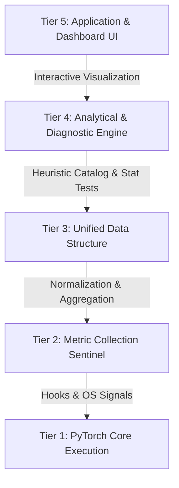

# VisionProf


**Cross-Platform PyTorch Layer Profiler & Automated Heuristic Bottleneck Analyzer**

VisionProf is a highly precise, cross-platform performance profiling and diagnostic framework engineered specifically for Computer Vision models running on varied hardware ecosystems (Edge CPU laptops and Cloud GPU instances). By non-intrusively hooking into PyTorch's execution graph, VisionProf extracts micro-second level metrics and applies a robust 19-rule heuristic engine to automatically pinpoint I/O bottlenecks, compute starvation, memory fragmentation, and architectural inefficiencies.

> [!NOTE]
> **Project Roadmap & Status**:
> The directory structure, heuristics, and benchmark figures presented in this document represent the **v1.0 baseline**. The system is being actively refactored to **v2.0/v3.0** featuring 3-tier modular separation (Layer, Model, Stage), Deferred CUDA Events, Heuristic Catalog v2.0, and Tail Latency metrics (P50–P99).  
> For technical rules, architecture contracts, and implementation plans, please refer to [`AGENTS.md`](./AGENTS.md), [`PROJECT_PLAN.md`](./PROJECT_PLAN.md), and [`TECHNICAL_SPECIFICATION.md`](./TECHNICAL_SPECIFICATION.md).

## Key Highlights & Core Contributions

- **`LayerProfiler` Mechanism:** Employs PyTorch `register_forward_pre_hook` and `register_forward_hook` to intercept model execution at the micro-second level. It dynamically calculates Activation Memory directly from output tensors and tracks Resident Set Size (RSS) RAM efficiently, ensuring the profiling itself does not become a bottleneck.
- **`Overhead Calibration`:** Implements an advanced auto-calibration system that measures the discrepancy between `no_hook` and `with_hook` executions using median aggregation, mathematically factoring out the profiler's own execution time to report true layer latency.
- **`DataLoaderSentinel`:** A specialized I/O watchdog that monitors data fetching pipelines to instantly detect Compute Starvation and Dataloader bottleneck symptoms.
- **`ABComparisonEngine`:** Facilitates granular performance comparisons. Supports Same-Architecture matching (via exact `layer_name`) and robust Cross-Architecture fallback grouping (via `layer_type`). Includes built-in non-parametric Mann-Whitney U statistical testing to validate whether performance deltas are statistically significant or merely execution noise.

## 5-Tier System Architecture & Directory Tree

### Architecture Diagram



### Directory Tree (Canonical Modular Architecture v2.0)

```
VisionProf/
├── src/
│   ├── core/              # Shared interfaces, types, constants, path builders
│   ├── layer/             # [TV1] Layer-level profiling (Deferred CUDA Events, FLOPs, Memory)
│   ├── model/             # [TV2] Model-level benchmarking & 100ms background ResourceSampler
│   ├── zoo/               # [TV2] 8 Model Adapters (CV, NLP, Tabular/XGBoost)
│   ├── phase/             # [TV3] Stage/Phase timer & DataLoaderSentinel
│   ├── analyzer/          # [TV3] 19 Diagnostic Heuristics v2.0 & A/B Engine
│   └── dashboard/         # [TV3] 7-Tab Streamlit UI with Plotly visualizations
├── configs/               # Model and experiment YAML configs (TN1 -> TN7)
├── notebooks/             # colab_runner.ipynb (Google Colab CPU & T4 execution)
├── scripts/               # run_experiment.py, run_tests.py, verify_rules.py
├── results/               # Standardized results: results/{device}/{model}/{exp_id}/{config}/
├── tests/                 # Modular unit test suite
├── requirements.txt       # Project dependencies (including pyngrok)
└── README.md              # Project documentation
```

## The 19-Rule Heuristic Diagnostic Catalog

VisionProf operates a comprehensive suite of 19 heuristic rules (categorized into 4 domains) designed to automatically diagnose underlying PyTorch inefficiencies:

| Rule ID | Name | Category | Description |
| :--- | :--- | :--- | :--- |
| **RA-01** | OOM Risk | R-A (Memory) | Detects if peak memory approaches system limits. |
| **RA-02** | Fragmentation | R-A (Memory) | Identifies inefficient memory allocation patterns. |
| **RA-03** | Allocation Hotspot | R-A (Memory) | Locates individual layers consuming disproportionate RAM. |
| **RA-04** | Peak Memory Efficiency | R-A (Memory) | Assesses total activation memory relative to param count. |
| **RA-05** | Memory Leak LR | R-A (Memory) | Uses Linear Regression to detect subtle memory leaks over epochs. |
| **RB-01** | Layer Speed Imbalance | R-B (Compute) | Finds layers that deviate heavily from mean execution time. |
| **RB-02** | Compute Variance CV | R-B (Compute) | Evaluates stability of compute time (Coefficient of Variation). |
| **RB-03** | Serial Bottleneck | R-B (Compute) | Detects operations causing CPU thread serialization. |
| **RB-04** | Time per Parameter | R-B (Compute) | Analyzes ms/Mparam to find inefficient mathematical formulations. |
| **RB-05** | Device Utilization Drop| R-B (Compute) | Flags sudden drops in hardware utilization during forward pass. |
| **RC-01** | I/O Bottleneck Ratio | R-C (DataLoader) | Flags when data loading time > compute time. |
| **RC-02** | DataLoader Variance | R-C (DataLoader) | Identifies inconsistent batch delivery causing jitter. |
| **RC-03** | Compute Starvation | R-C (DataLoader) | Detects GPU/CPU idling while waiting for the next batch. |
| **RC-04** | Zero-Worker Warning | R-C (DataLoader) | Warns against using `num_workers=0` in production. |
| **RD-01** | Parameter Concentration| R-D (Architecture) | Detects models where >50% params are in a single layer. |
| **RD-02** | Dead/Zero-Time Layer | R-D (Architecture) | Identifies redundant layers with zero measurable impact. |
| **RD-03** | Layer Type Diversity | R-D (Architecture) | Assesses architectural complexity (excessive distinct ops). |
| **RD-04** | Depth Profile | R-D (Architecture) | Evaluates if model depth causes excessive sequential latency. |
| **RD-05** | Param-Time Outliers | R-D (Architecture) | Flags layers with low param count but disproportionately high latency. |

## Experimental Results & Key Findings

All benchmarks were conducted locally on Windows CPU, processing inputs of shape `[1, 3, 224, 224]` over 8 iterations.

### Table 1: DataLoader Bottleneck Test

| DataLoader Type | Delay Injection | Mean Load (ms) | Mean Compute (ms) | I/O Ratio | Diagnostics Status |
| :--- | :---: | :---: | :---: | :---: | :--- |
| `fast_loader` | 0 ms | 1.40 ms | 573.36 ms | 0.2% | OK |
| `slow_loader` | 20 ms | 171.02 ms | 590.16 ms | 21.9% | OK |
| `critical_loader`| 80 ms | 646.13 ms | 569.14 ms | 52.3% | **Bottleneck Warning** |

### Table 2: 5 Modern Vision Architectures Benchmark

| Model | Params (M) | Hooks | Total Time | Mean/iter | Peak Act. Mem | Overhead | Health (Pass/19) |
| :--- | :---: | :---: | :---: | :---: | :---: | :---: | :---: |
| **MobileNetV3-Large** | 5.48 M | 95 | 287.3 ms | **35.92 ms** | 22.6 MB | 0.0461 ms/L | 73.7% (14) |
| **YOLOv8n** | 3.16 M | 129 | 349.0 ms | **43.63 ms** | 21.8 MB | 0.0000 ms/L | 78.9% (15) |
| **YOLOv11n** | 2.62 M | 177 | 506.8 ms | **63.35 ms** | 25.3 MB | 0.1333 ms/L | 73.7% (14) |
| **ConvNeXt-Tiny** | 28.59 M | 102 | 1034.6 ms | **129.33 ms** | 95.3 MB | 0.1569 ms/L | 78.9% (15) |
| **ViT-B/16** | 86.57 M | 87 | 2732.7 ms | **341.59 ms** | 105.0 MB | 0.0000 ms/L | 84.2% (16) |

### Table 3: Cross-Architecture & Same-Architecture A/B Comparison Insights

- **`ConvNeXt-Tiny` vs `ViT-B/16`**: ConvNeXt is statistically significantly faster (speedup **0.270x**, p < 0.0001).
- **`ConvNeXt-Tiny` vs `MobileNetV3-Large`**: MobileNet provides a massive speedup of **5.225x** for edge devices.
- **The YOLO Paradox (`YOLOv8n` vs `YOLOv11n`)**: Despite `YOLOv11n` having fewer parameters (2.62M vs 3.16M), it executes noticeably slower on CPU (63.35 ms vs 43.63 ms). VisionProf reveals that YOLOv11n has a highly fragmented architecture (177 layers compared to YOLOv8n's 129 layers). On CPUs, sequential layer dispatch overhead outpaces the compute savings from fewer parameters.

## Interactive 5-Tab Streamlit Dashboard

Launch the UI (`streamlit run src/dashboard.py`) to access 5 advanced visualization interfaces powered by Plotly:

1. **Tab 1: Overview** – High-level Bar and Pie charts tracking macroscopic throughput, total memory footprint, and overarching framework latency.
2. **Tab 2: Layer Deep-Dive** – Interactive Sunburst and Treemap visualizations projecting hierarchical time and memory distribution down to individual nested `Conv2d` and `Linear` layers.
3. **Tab 3: Rule Catalog Diagnostics** – Immediate alerts triggered by the 19-Rule Heuristic Engine, isolating bottleneck layers and memory hotspots.
4. **Tab 4: Statistical A/B Comparison** – Boxplots and Violin plots comparing latency distributions across two models or configurations, complete with Mann-Whitney U test p-values.
5. **Tab 5: DataLoader I/O Sentinel** – Timeline plots tracking data delivery latency against compute bounds, visualizing "Compute Starvation" epochs.

## Installation & Quick-Start Guide

Set up a virtual environment, install dependencies, and execute the analysis suite in under two minutes.

```bash
# Clone the repository
git clone https://github.com/Huu-Tuan13-09/VisionProf.git
cd VisionProf

# Create and activate environment
python -m venv .venv
# source .venv/bin/activate  # On Linux/MacOS
.venv\Scripts\activate       # On Windows

# Install required packages
pip install -r requirements.txt

# Run Profiling Benchmarks
python tests/test_training_bottleneck.py
python tests/test_modern_models_benchmark.py

# Launch the Visual Dashboard
streamlit run src/dashboard.py

# Run internal framework tests
pytest tests/ -v -s
```

## Programmatic Python API Usage Example

Integrate VisionProf directly into your custom training or inference loop seamlessly:

```python
import torch
import torchvision.models as models
from src.collector import LayerProfiler, DataLoaderSentinel
from src.analyzer import analyze_from_csv, compare_ab_from_csv

# Initialize Model & Profiler
model = models.mobilenet_v3_large().cpu()
profiler = LayerProfiler(model, device="cpu", project_name="MyProject")

# Profile inference execution
profiler.start()
dummy_input = torch.randn(1, 3, 224, 224)
output = model(dummy_input)
profiler.stop()

# Export data and apply Heuristic Rules
csv_path = profiler.export_to_csv("reports/my_model_profile.csv")
report = analyze_from_csv(csv_path)
print(f"Health Score: {report['health_score']}%")

# (Optional) Compare two exported models
# compare_ab_from_csv("reports/model_a.csv", "reports/model_b.csv")
```
