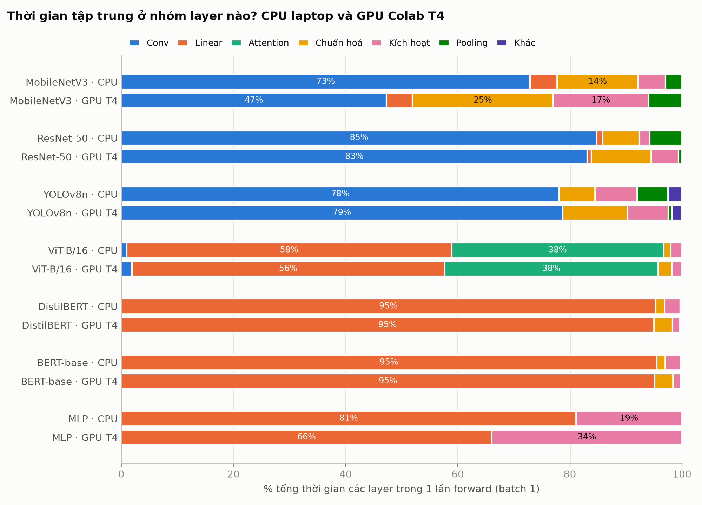
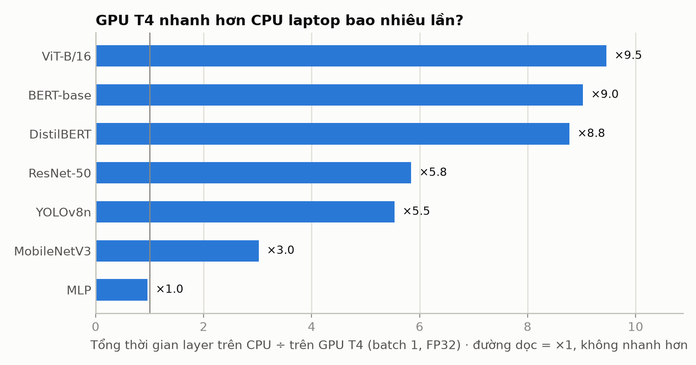
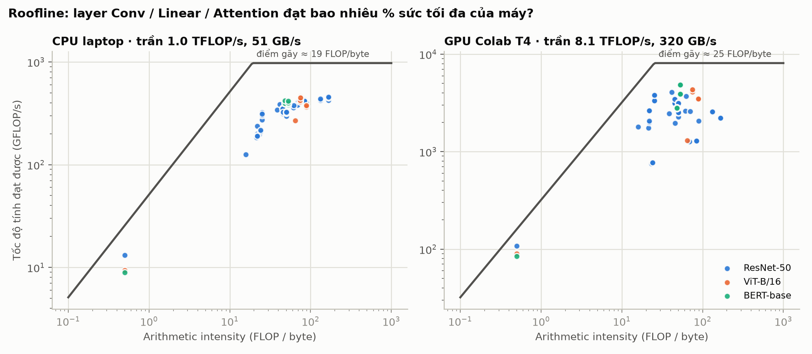
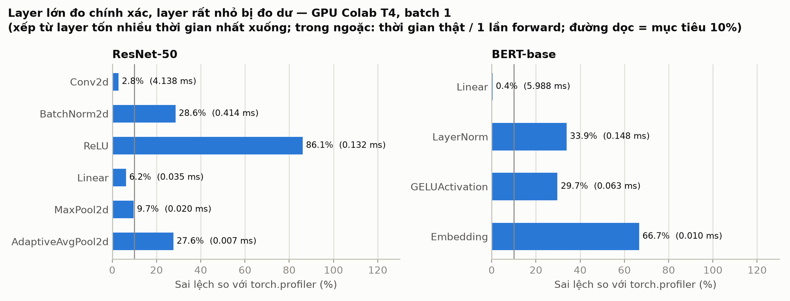

# Báo cáo phần TV1 — Mức Layer & Độ chính xác

> **Ghi chú khi ghép báo cáo:** các mục dưới đây được đánh số theo dàn ý chung (PROJECT_PLAN, Mục 9).
> TV1 phụ trách: Chương 2, Chương 3, mục Thiết kế mức Layer (Chương 4), kết quả CH1–CH2 (Chương 6)
> và phần hạn chế của mức Layer (Chương 7). Hình nằm trong `docs/tv1/figures/`, số liệu gốc nằm trong
> `results/` và có thể tạo lại bằng các lệnh ở Phụ lục.

---

## Chương 2. Kiến thức nền

### 2.1. Forward hook trong PyTorch

Một mô hình PyTorch là một cây `nn.Module`: module gốc (cả mô hình) chứa các module con (khối, tầng),
và ở tầng thấp nhất là các **leaf module** — module không có module con, ví dụ `Conv2d`, `Linear`,
`BatchNorm2d`, `ReLU`. PyTorch cho phép gắn hàm theo dõi vào bất kỳ module nào mà không sửa mã nguồn
mô hình:

- `register_forward_pre_hook(fn)`: `fn` được gọi **ngay trước** khi module chạy, nhận input của module.
- `register_forward_hook(fn)`: `fn` được gọi **ngay sau** khi module chạy, nhận cả input và output.

Đặt mốc thời gian ở pre-hook và post-hook của mỗi leaf module cho ta thời gian của từng layer. Chỉ
gắn vào leaf module để tránh **đếm trùng**: thời gian của một khối đã bao gồm thời gian các layer con.

Cách này có hai giới hạn cần biết:

1. **Phép tính dạng hàm không có hook.** Các phép như `x + shortcut` (cộng residual), `torch.cat`,
   `torch.matmul` trong attention được gọi trực tiếp bằng hàm, không qua module nào, nên hook không
   thấy chúng. Phần thời gian này được gọi là **thời gian không thuộc layer nào** (unattributed time).
2. **Một module có thể được gọi nhiều lần** trong một lần forward (module dùng chung). Ví dụ YOLOv8n
   dùng chung một module `SiLU` cho mọi khối. Nếu chỉ lưu một mốc bắt đầu cho mỗi module, lần gọi
   sau sẽ ghi đè lần gọi trước.

### 2.2. GPU chạy bất đồng bộ và CUDA Events

Khi chạy trên GPU, Python (CPU) **không chờ** GPU tính xong. Mỗi phép tính chỉ được CPU **gửi vào
hàng đợi** (CUDA stream) rồi CPU chạy tiếp ngay; GPU lấy lệnh ra và tính sau. Hệ quả:

- Đo bằng đồng hồ CPU (`time.perf_counter`) quanh một layer chỉ đo được **thời gian CPU gửi lệnh**
  (vài micro-giây), không phải thời gian GPU tính. Đây là lỗi của phiên bản VisionProf v1.0.
- Gọi `torch.cuda.synchronize()` (bắt CPU chờ GPU xong) sau mỗi layer thì đo đúng, nhưng phá vỡ
  việc CPU và GPU chạy song song, làm mô hình chậm đi nhiều và sai lệch kết quả.

**CUDA Event** là cách đo chuẩn: một event là một "mốc" được gửi vào hàng đợi cùng với các phép
tính. Khi GPU chạy tới mốc, nó ghi lại thời điểm của chính GPU. Sau khi cả lần forward kết thúc, chỉ
cần **đồng bộ một lần** rồi đọc khoảng cách giữa các cặp mốc (`start.elapsed_time(end)`).

Event đo **khoảng thời gian trên dòng thời gian của GPU** giữa hai mốc. Nếu GPU đang rảnh và phải chờ
CPU gửi lệnh tiếp theo, thời gian chờ đó cũng bị tính vào. Ngoài ra, mỗi cặp event có một **ngưỡng
sàn** — thời gian đo được ngay cả khi giữa hai mốc chỉ có một phép tính rất nhỏ. Hai điều này quyết
định độ chính xác khi đo các layer rất nhỏ (Mục 6.2).

Một điểm nữa cần lưu ý là **đồng bộ ngầm**: một số thao tác (ví dụ `tensor.item()`, hoặc kiểm tra
giá trị của một tensor trên GPU bằng `if`) bắt CPU phải chờ GPU, dù mã không gọi `synchronize()`.

### 2.3. FLOPs, arithmetic intensity và mô hình Roofline

- **FLOPs** (floating-point operations): số phép tính dấu phẩy động một layer phải làm. Ví dụ
  `Conv2d` có FLOPs = 2·B·C<sub>out</sub>·H<sub>out</sub>·W<sub>out</sub>·(C<sub>in</sub>/groups)·K<sub>h</sub>·K<sub>w</sub>,
  `Linear` có FLOPs = 2·B·N<sub>in</sub>·N<sub>out</sub> (hệ số 2 vì mỗi phép nhân đi kèm một phép cộng).
- **Lưu lượng bộ nhớ** (bytes): số byte phải đọc/ghi — input + trọng số + output của layer.
- **Arithmetic intensity** (AI, FLOP/byte) = FLOPs ÷ bytes: mỗi byte dữ liệu được "dùng" cho bao
  nhiêu phép tính.

**Mô hình Roofline** cho biết tốc độ tính tối đa một layer có thể đạt trên một máy:

$$P_{\text{attainable}} = \min\left(P_{\text{peak}},\; B_{\text{peak}} \times AI\right)$$

trong đó P<sub>peak</sub> là sức tính tối đa (GFLOP/s) và B<sub>peak</sub> là băng thông bộ nhớ tối đa
(GB/s). Điểm **AI\* = P<sub>peak</sub> / B<sub>peak</sub>** (điểm gãy) chia layer làm hai loại:

- AI < AI\*: layer **giới hạn bởi bộ nhớ** (memory-bound) — có tính nhanh đến mấy cũng phải chờ dữ liệu.
  Điển hình: BatchNorm, ReLU, LayerNorm.
- AI ≥ AI\*: layer **giới hạn bởi sức tính** (compute-bound). Điển hình: Conv 3×3, Linear lớn.

**Hiệu suất** của một layer = tốc độ đạt được ÷ P<sub>attainable</sub>. Chỉ số này giúp trả lời "layer
chậm vì nó thật sự nặng, hay vì nó chưa dùng hết sức máy?".

### 2.4. Đo hiệu năng sao cho tin cậy

- **Khởi động (warm-up):** vài lần chạy đầu chậm hơn hẳn (cấp phát bộ nhớ, cuDNN chọn thuật toán,
  CPU tăng xung nhịp), nên bỏ qua 10 vòng đầu rồi mới đo.
- **Đo nhiều vòng, lấy trung vị:** trung vị (median) ít bị ảnh hưởng bởi vài lần chạy bị giật hơn
  trung bình cộng. Nhóm đo 50 vòng.
- **Chạy xen kẽ A–B–A–B** khi so sánh hai cấu hình, để máy nóng dần lên không làm lệch về một phía.
- **Chi phí của chính công cụ đo:** gắn hook làm mô hình chậm đi (overhead). Một phần chi phí này nằm
  ngay *bên trong* khoảng đo của mỗi layer (sai số hệ thống), phần còn lại nằm *giữa* các layer. Hai
  phần này cần được đo riêng: phần thứ nhất để hiệu chỉnh, phần thứ hai để báo cáo.

---

## Chương 3. Các công cụ liên quan

| Công cụ | Đo được gì | Ưu điểm | Hạn chế so với nhu cầu của dự án |
| :--- | :--- | :--- | :--- |
| **`torch.profiler`** (PyTorch, dựa trên Kineto / CUPTI) | Thời gian từng **phép toán** (`aten::conv2d`, `aten::addmm`…) trên CPU và GPU, thời gian kernel GPU chính xác | Có sẵn trong PyTorch, đo kernel GPU rất chính xác | Kết quả theo phép toán chứ không theo **layer** của mô hình; trace lớn, khó so sánh CPU–GPU tự động; không có FLOPs/hiệu suất theo layer |
| **NVIDIA Nsight Systems / Nsight Compute** | Dòng thời gian toàn hệ thống; chỉ số phần cứng của từng kernel (băng thông DRAM, độ chiếm dụng…) | Chính xác và sâu nhất về GPU | Chỉ cho GPU NVIDIA; cài đặt và đọc kết quả phức tạp; không gắn với khái niệm layer của PyTorch |
| **TensorBoard Profiler** (plugin cho `torch.profiler`) | Hiển thị trace của `torch.profiler` | Giao diện trực quan | Kế thừa các giới hạn của `torch.profiler` |
| **Bộ đếm FLOPs** (`fvcore`, `thop`, `ptflops`, `FlopCounterMode`) | FLOPs / số tham số của mô hình | Nhanh, không cần chạy trên phần cứng đích | Chỉ đếm phép tính, không đo thời gian thật |

**VisionProf (mức Layer) khác ở chỗ:** đo **theo layer** của mô hình (đúng đơn vị mà người dùng
nghĩ tới), dùng cùng một API cho CPU và GPU, **ghép thời gian đo được với FLOPs và thông số phần
cứng** để ra hiệu suất Roofline của từng layer, và xuất bảng so sánh CPU–GPU tự động. `torch.profiler`
được dùng làm **chuẩn đối chiếu** để kiểm chứng độ chính xác (CH2).

---

## Chương 4 (mục của TV1). Thiết kế mức Layer

### 4.x.1. Vị trí trong framework

Mức Layer được đóng gói thành plugin `layer` theo hợp đồng chung của nhóm (PROJECT_PLAN, Mục 8.1):
script chạy thực nghiệm gọi `attach(model, device)` → `start(i)` / `stop()` quanh mỗi lần forward →
`save(out_dir)`. Plugin ghi ra ba file:

| File | Nội dung |
| :--- | :--- |
| `layers.csv` | 1 dòng / layer / lần gọi / vòng đo: thời gian, bộ nhớ output, FLOPs, số tham số, thứ tự chạy… |
| `layers_summary.csv` | 1 dòng / layer: thời gian trung vị, GFLOP/s đạt được, arithmetic intensity, % hiệu suất, compute/memory-bound |
| `layer_meta.json` | số layer được đo, tổng FLOPs, thông số phần cứng, tổng thời gian mỗi vòng, chất lượng số đo GPU |

Các thành phần chính (`src/`):

| Thành phần | Vai trò |
| :--- | :--- |
| `collector.py` → `LayerProfiler` | Gắn hook, đo thời gian và bộ nhớ từng layer |
| `collector.py` → `calibrate_overhead_details`, `estimate_timer_bias` | Đo chi phí của chính công cụ đo |
| `flops.py` | Đếm FLOPs, lưu lượng bộ nhớ, tính hiệu suất Roofline |
| `hw_specs.py` | Thông số tối đa của CPU laptop và GPU T4 |
| `layer_plugin.py` | Plugin `layer` theo hợp đồng chung |
| `layer_analysis.py` | Top-10 layer, tỷ trọng theo loại layer, bảng CPU–GPU |

### 4.x.2. Chọn layer để đo

- Đo mọi **leaf module**, trừ `Dropout` và `Identity` (không tính toán gì khi suy luận).
- **`nn.MultiheadAttention` được đo nguyên khối.** Bên trong khối này, phần lớn tính toán (chiếu
  Q/K/V, nhân ma trận attention) được viết bằng hàm, layer con duy nhất là `out_proj`. Nếu chỉ hook
  leaf module, gần hết thời gian attention của ViT sẽ bị bỏ sót (FLOPs đo được chỉ còn 22.5 G thay vì
  35.1 G). Đo nguyên khối giải quyết được vấn đề này và cho phép so "Attention" như một loại layer.

### 4.x.3. Đo thời gian

- **CPU:** `time.perf_counter_ns()` ở pre-hook và post-hook. Mọi việc tốn thời gian của hook (đọc
  shape, tính bộ nhớ) đều làm **ngoài** khoảng đo: pre-hook bấm giờ ở dòng cuối, post-hook dừng
  bấm giờ ở dòng đầu.
- **GPU:** mỗi layer một cặp **CUDA event** lấy từ một pool dùng lại giữa các vòng; **chỉ đồng bộ một
  lần** sau khi cả lần forward kết thúc rồi mới đọc thời gian (Deferred Synchronization).
- **Lấp hàng đợi GPU:** trước mỗi lần forward, cho GPU bận một khoảng ngắn (`torch.cuda._sleep`) để
  CPU kịp xếp hết các lệnh vào hàng đợi. Khi đó GPU chạy liền mạch và khoảng giữa hai event là thời
  gian GPU tính, không lẫn thời gian GPU ngồi chờ CPU gửi lệnh. Khoảng thời gian này tự điều chỉnh
  theo thời gian CPU xếp lệnh của vòng trước; `layer_meta.json` ghi lại tỷ lệ vòng GPU thật sự chạy
  liền mạch (`gpu_prefill_ok_ratio`).
- **Module được gọi nhiều lần:** mỗi module có một **stack** riêng chứa các mốc bắt đầu; mỗi lần gọi
  được ghi thành một dòng riêng với `call_index`.

### 4.x.4. Đo bộ nhớ

- **Bộ nhớ output của layer** (`activation_mb`) = Σ (số phần tử × số byte mỗi phần tử) của **mọi**
  tensor trong output (layer có thể trả về nhiều tensor, như head của YOLO).
- **Không đếm trùng** output dùng chung vùng nhớ với input: `ReLU(inplace=True)` ghi đè lên input,
  `Flatten` trả về một "view" — cả hai đều không cấp phát bộ nhớ mới, nên được tính là 0.
- **RAM của cả chương trình** được đo một lần mỗi vòng và để ở cột riêng (`process_rss_mb`). Phiên
  bản v1.0 trộn hai đại lượng này, khiến mọi layer trên CPU bị gán ~500 MB.
- Mặc định **không** gọi `torch.cuda.memory_allocated()` trong hook: hàm này tốn khoảng 0.2 ms mỗi lần
  gọi trên PyTorch 2.14, và riêng việc gọi nó đã làm overhead trên GPU tăng từ 143% lên 558%.

### 4.x.5. Chi phí của chính công cụ đo

Tách làm hai đại lượng (xem Mục 2.4):

| Đại lượng | Cách đo | Dùng để |
| :--- | :--- | :--- |
| **Timer bias** — sai số nằm *bên trong* khoảng đo mỗi layer | Profile một chuỗi 64 `nn.Identity` (không tính gì), lấy trung vị thời gian đo được | **Trừ** vào thời gian từng layer trên CPU |
| **Overhead** — model chậm đi bao nhiêu khi gắn công cụ đo | Chạy xen kẽ có hook / không hook, so trung vị | **Báo cáo** (CH2) |
| **Ngưỡng sàn** — thời gian đo được của một phép tính nhỏ nhất | Profile chuỗi 64 `ReLU` trên tensor 1 phần tử | Đánh giá layer nào quá nhỏ để đo tin cậy (CH2) |

Phiên bản v1.0 lấy overhead *tổng* chia cho số layer *có tham số* rồi trừ vào từng layer: mẫu số
sai (bỏ qua ReLU, Pooling…) và trừ cả phần chi phí nằm ngoài khoảng đo, khiến nhiều layer bị ép về
`0.0000 ms`.

### 4.x.6. FLOPs và hiệu suất

- FLOPs lấy bằng `torch.utils.flop_counter.FlopCounterMode`. Hai phép attention gộp mà công cụ này
  chưa đếm khi chạy trên CPU (`_native_multi_head_attention`, `_scaled_dot_product_flash_attention_for_cpu`)
  được bổ sung công thức chuẩn. Kết quả khớp số công bố: ResNet-50 8.18 GFLOPs, ViT-B/16 35.13 G,
  YOLOv8n 8.74 G, BERT-base (128 token) 22.35 G.
- Layer mà `FlopCounterMode` không đếm (BatchNorm, LayerNorm, hàm kích hoạt, Pooling) được ước lượng
  theo số phần tử output và đánh dấu `flops_source = "analytic"`.
- Hiệu suất tính theo Roofline (Mục 2.3) với thông số trong `hw_specs.py`: GPU T4 lấy theo datasheet
  (8.1 TFLOP/s FP32, 320 GB/s); CPU laptop được **ước lượng** = số nhân × xung nhịp × 32 FLOP/chu kỳ
  (AVX2 + FMA), băng thông 51.2 GB/s (DDR4-3200 kênh đôi).

---

## Chương 6 (mục của TV1). Kết quả CH1 và CH2

**Thiết lập chung.** Batch 1, FP32, chế độ suy luận (`eval` + `no_grad`). Khởi động 10 vòng, đo
50 vòng, lấy trung vị. CPU: laptop của TV1 (8 nhân, ~3.8 GHz). GPU: Google Colab, NVIDIA Tesla T4.
Bảy mô hình PyTorch của nhóm; XGBoost không có layer nên không thuộc mức này. Mô hình được dựng từ
cấu trúc với trọng số ngẫu nhiên — giá trị trọng số không ảnh hưởng tốc độ của các phép tính này.

### 6.1. CH1 — Thời gian tốn nhiều nhất ở loại layer nào? CPU và GPU khác nhau ra sao?

**Kỳ vọng:** trên CPU, Conv/Linear chiếm phần lớn thời gian; trên GPU, tỷ trọng của các layer nhỏ
(chuẩn hoá, kích hoạt) tăng lên.



*Hình 6.1. Tỷ trọng thời gian theo nhóm layer trên CPU laptop và GPU T4 (batch 1).*

**Bảng 6.1. Tổng thời gian các layer trong một lần forward**

| Mô hình | CPU (ms) | GPU T4 (ms) | GPU nhanh hơn | Nhóm layer tốn nhiều nhất (CPU → GPU) |
| :--- | :-: | :-: | :-: | :--- |
| MobileNetV3-Large | 8.48 | 2.81 | ×3.0 | Conv 73% → 47%; Chuẩn hoá 14% → 25%; Kích hoạt 5% → 17% |
| ResNet-50 | 30.12 | 5.15 | ×5.8 | Conv 85% → 83%; BatchNorm 7% → 11%; MaxPool 6% → 0.4% |
| YOLOv8n | 30.61 | 5.53 | ×5.5 | Conv 78% → 79%; BatchNorm 6% → 12%; MaxPool 5.5% → 0.7% |
| ViT-B/16 | 90.10 | 9.53 | ×9.5 | Linear 58% → 56%; Attention 38% → 38% |
| DistilBERT | 28.20 | 3.21 | ×8.8 | Linear 95% → 95% |
| BERT-base | 56.33 | 6.24 | ×9.0 | Linear 95% → 95% |
| MLP (dữ liệu bảng) | 0.03 | 0.03 | ×1.0 | Linear 81% → 66%; ReLU 19% → 34% |



*Hình 6.2. Tổng thời gian các layer trên CPU ÷ trên GPU T4.*

**Nhận xét.**

1. **Transformer được GPU tăng tốc mạnh nhất.** ViT-B/16, BERT-base và DistilBERT nhanh hơn ×8.8–9.5
   trên T4, vì gần như toàn bộ thời gian (94–96%) nằm ở Linear và Attention — các phép nhân ma trận lớn,
   đúng loại việc GPU làm tốt nhất. MobileNetV3 chỉ nhanh hơn ×3.0, còn MLP gần như không nhanh hơn
   (×1.0) vì mô hình quá nhỏ để tận dụng GPU.
2. **Kỳ vọng "trên GPU, layer nhỏ chiếm tỷ trọng lớn hơn" đúng với CNN, rõ nhất ở mô hình nhẹ.** Với
   MobileNetV3, tỷ trọng Conv giảm từ 73% xuống 47%, trong khi chuẩn hoá tăng từ 14% lên 25% và kích
   hoạt từ 5% lên 17%. Với ResNet-50 và YOLOv8n, Conv vẫn chiếm ~80% trên cả hai máy nhưng BatchNorm
   tăng gần gấp đôi (7% → 11%, 6% → 12%). Với Transformer, tỷ trọng gần như **không đổi** — Linear
   chiếm 95% trên cả hai máy — nên kỳ vọng không áp dụng cho nhóm này.
3. **Thứ hạng từng layer thay đổi mạnh giữa CPU và GPU.** Với ResNet-50, layer chậm nhất trên CPU là
   `maxpool` (1.67 ms), nhưng trên GPU nó chỉ còn 0.023 ms và tụt xuống hạng 59 (nhanh hơn ×74). Các
   Conv 1×1 (`downsample`) được tăng tốc ×6–9.6, trong khi các Conv 3×3 ở tầng cuối (`layer4.x.conv2`)
   chỉ ×3.6–3.8 và trở thành nhóm layer chậm nhất trên GPU (bảng đầy đủ:
   `results/analysis/TN1/resnet50/report.md`).



*Hình 6.3. Roofline của các layer Conv / Linear / Attention (có FLOPs đếm được) của ResNet-50, ViT-B/16 và BERT-base.*

4. **Vì sao các layer lớn chưa nhanh hơn nữa?** Trên Hình 6.3, hầu hết Conv, Linear và Attention có
   arithmetic intensity 15–170 FLOP/byte, tức nằm ở vùng **compute-bound** trên cả hai máy (điểm gãy
   ≈ 19 FLOP/byte trên CPU và ≈ 25 trên T4). Trung vị hiệu suất của chúng chỉ khoảng 30–55% trần sức
   tính (Conv của ResNet-50: 33% trên CPU, 32% trên T4; Linear của ViT: 44% và 53%). Với batch 1,
   các phép nhân ma trận còn nhỏ nên phần cứng chưa được dùng hết. Riêng Conv của MobileNetV3 chỉ đạt
   ~15% trên cả hai máy: depthwise conv có rất ít phép tính trên mỗi byte dữ liệu. Các điểm có
   AI ≈ 0.5 ở góc dưới bên trái là **layer Linear cuối cùng** (lớp phân loại, pooler): ở batch 1, mỗi
   trọng số chỉ được dùng một lần nên chúng bị giới hạn bởi bộ nhớ.

**Kết luận CH1.** Trên CPU, thời gian tập trung ở Conv (CNN: 73–85%) và Linear + Attention
(Transformer: 95–96%). Khi chuyển sang GPU, Transformer được tăng tốc nhiều nhất (~×9) và tỷ trọng
không đổi; CNN được tăng tốc ít hơn (×3–6) và các layer nhỏ như BatchNorm, hàm kích hoạt chiếm tỷ
trọng lớn hơn, rõ nhất ở mô hình nhẹ MobileNetV3. Các layer lớn ở batch 1 mới đạt khoảng 30–55% sức
tối đa của máy.

### 6.2. CH2 — Công cụ đo có đúng không, và làm mô hình chậm đi bao nhiêu?

**Cách kiểm chứng (TN2).** Với ResNet-50 và BERT-base, trên mỗi máy:

1. **Sai lệch:** cộng thời gian các layer cùng loại (ví dụ mọi `Conv2d`) và so với thời gian của phép
   toán tương ứng (`aten::conv2d`) do `torch.profiler` đo (trên GPU: thời gian kernel từ CUPTI).
2. **Overhead:** chạy xen kẽ có hook / không hook 50 lần, so trung vị.
3. **Thời gian không thuộc layer nào:** (thời gian forward − Σ thời gian các layer) ÷ thời gian forward.
4. **Ngưỡng sàn** của bộ đo và tỷ lệ layer nhanh hơn 3 lần ngưỡng này.

**Bảng 6.2. Kết quả TN2**

| | CPU laptop: ResNet-50 | CPU laptop: BERT-base | GPU T4: ResNet-50 | GPU T4: BERT-base |
| :--- | :-: | :-: | :-: | :-: |
| Thời gian forward không hook | 30.79 ms | 66.36 ms | 5.98 ms | 9.36 ms |
| **Sai lệch tổng so với `torch.profiler`** | **0.35%** | **0.27%** | **7.50%** | **0.84%** |
| Overhead | 11.3% | 5.2% | 166% | 109% |
| Thời gian không thuộc layer nào | 3.9% | 9.2% | 9.0% | 10.3% |
| Ngưỡng sàn của bộ đo | 2.3 µs | 2.3 µs | 6.1 µs | 6.4 µs |
| Layer nhanh dưới 3× ngưỡng sàn | 0% | 0% | 60% | 37% |
| Đồng bộ ngầm mỗi lần forward | 0 | 0 | 0 | 0 |



*Hình 6.4. Sai lệch so với `torch.profiler` theo loại layer trên GPU T4.*

**Nhận xét.**

1. **Đạt mục tiêu G3 (sai lệch < 10%) trên cả CPU và GPU.** Trên CPU, sai lệch tổng chỉ 0.27–0.35%.
   Trên GPU, sai lệch tổng là 7.5% (ResNet-50) và 0.84% (BERT-base).
2. **Trên GPU, layer lớn đo chính xác, layer rất nhỏ bị đo dư (Hình 6.4).** Conv2d lệch 2.8%, Linear
   0.4–6.2%; nhưng các layer chỉ chạy vài micro-giây mỗi lần như ReLU (86%), BatchNorm (29%),
   LayerNorm (34%) bị đo dư. Nguyên nhân là ngưỡng sàn của CUDA event (~6 µs trên T4) xấp xỉ chính thời
   gian của các layer này. Với ResNet-50 ở batch 1, 60% số layer nhanh dưới 3 lần ngưỡng sàn. Vì các
   layer nhỏ này chỉ chiếm phần nhỏ của tổng thời gian, sai lệch tổng vẫn dưới 10%.
3. **Overhead trên CPU 5–11%, trên GPU 109–166%.** Mục tiêu < 5% chưa đạt. Trên CPU, mỗi layer tốn
   thêm khoảng 28–30 µs cho hook; ResNet-50 có nhiều layer nhỏ (126 layer cho 30 ms) nên overhead
   tính theo % cao hơn BERT-base (114 layer cho 66 ms). Trên GPU ở batch 1,
   chính CPU (gửi lệnh) mới là giới hạn của tốc độ: GPU tính xong mỗi layer rất nhanh rồi chờ lệnh tiếp
   theo, nên mọi chi phí thêm của hook Python đều cộng thẳng vào thời gian chạy. Overhead không làm sai
   thời gian từng layer (nhờ đo bằng CUDA event và lấp hàng đợi), nhưng có nghĩa là **không nên bật mức
   Layer khi đo tổng thời gian của mô hình** — việc đó thuộc mức Model (TV2).
4. **Phần thời gian không thuộc layer nào: 4–10%.** Với ResNet-50, đó là các phép cộng residual; với
   BERT-base, đó là phép nhân ma trận và softmax của attention được viết bằng hàm.
5. **Đồng bộ ngầm làm hỏng số đo GPU.** Ở lần chạy đầu tiên, sai lệch của BERT-base trên T4 lên tới 87%.
   Nguyên nhân: khi nhận `attention_mask`, thư viện `transformers` kiểm tra mask bằng một thao tác bắt
   CPU chờ GPU, làm hàng đợi GPU đã lấp sẵn bị xả hết. Vì input không có padding (mask toàn số 1), bỏ
   `attention_mask` không đổi kết quả mô hình nhưng đưa sai lệch về 0.84%. TN2 nay tự đếm số lần đồng
   bộ ngầm để phát hiện trường hợp này.
6. **Hệ điều hành ảnh hưởng tới độ chính xác của CUDA event.** Khi thử trên một GPU laptop chạy Windows
   (chế độ driver WDDM — không dùng cho số liệu báo cáo), ngưỡng sàn đo được là ~21 µs, gấp hơn 3 lần
   trên Colab (Linux). Một phép ReLU 4.9 µs được đo thành 37.8 µs. Vì vậy số liệu GPU của báo cáo chỉ
   lấy từ Colab.

**Kết luận CH2.** Công cụ đo đạt yêu cầu về độ chính xác: sai lệch tổng < 1% trên CPU và < 8% trên GPU
so với `torch.profiler`. Trên GPU, kết quả của các layer rất nhỏ (cỡ vài micro-giây) chỉ nên dùng để so
sánh tương đối. Overhead trên CPU 5–11% là chấp nhận được, nhưng trên GPU ở batch 1 overhead lớn, nên
mức Layer chỉ dùng để phân rã thời gian, không dùng để đo tổng thời gian.

---

## Chương 7 (phần của TV1). Hạn chế và hướng phát triển

| Hạn chế | Ảnh hưởng | Hướng khắc phục |
| :--- | :--- | :--- |
| CUDA event có ngưỡng sàn vài µs | Layer rất nhỏ trên GPU bị đo dư (BatchNorm, ReLU ở batch 1) | Thêm chế độ đo bằng CUPTI (cùng công nghệ với `torch.profiler`) và gán thời gian kernel về layer |
| Overhead trên GPU ở batch 1 lớn (109–166%) | Không dùng được để đo tổng thời gian khi bật mức Layer | Chỉ đo một phần số vòng (sampling); viết phần hook tốn thời gian nhất bằng C++ |
| Hook không thấy phép tính dạng hàm | 4–10% thời gian không được gán cho layer nào | Bổ sung theo dõi ở cấp phép toán (`TorchDispatchMode`) |
| Lưu lượng bộ nhớ tính theo mô hình "đọc hết từ RAM" | Layer nhỏ, dữ liệu nằm trong cache có hiệu suất > 100% | Chỉ dùng hiệu suất cho layer compute-bound; đo lưu lượng thật bằng Nsight Compute |
| Thông số CPU laptop là ước lượng | % hiệu suất trên CPU chỉ mang tính tương đối | Đo trần thực tế bằng một phép nhân ma trận lớn (micro-benchmark) |
| Chỉ đo batch 1, FP32, chiều forward | Chưa thấy layer thay đổi thế nào khi tăng batch, dùng FP16, hay khi training | Chạy lại TN1 với các cấu hình của TN4/TN5; đo backward từng layer (`register_full_backward_hook`) |
| Không áp dụng cho `torch.compile`, ONNX Runtime, TensorRT | Mô hình đã biên dịch gộp layer, hook không còn ý nghĩa | Dùng mức Model (đo hộp đen) cho các trường hợp này |

---

## Phụ lục — Tái lập kết quả

```bash
# Cài môi trường (PyTorch có CUDA nếu máy có GPU NVIDIA)
pip install -r requirements.txt

# CPU (laptop)
python experiments/tn1_layer_breakdown.py --device cpu
python experiments/tn2_validate_profiler.py --device cpu

# GPU (Google Colab, runtime T4)
python experiments/tn1_layer_breakdown.py --device cuda
python experiments/tn2_validate_profiler.py --device cuda

# Gộp kết quả CPU + GPU vào results/ rồi phân tích và vẽ hình
python experiments/tn1_layer_breakdown.py --analyze
python experiments/tv1_figures.py
```

Số liệu thô: `results/{cpu_laptop,colab_t4}/<model>/{TN1,TN2}/bs1_fp32/`.
Bảng phân tích: `results/analysis/TN1/<model>/report.md`, `results/analysis/TN2/summary_*.csv`.
