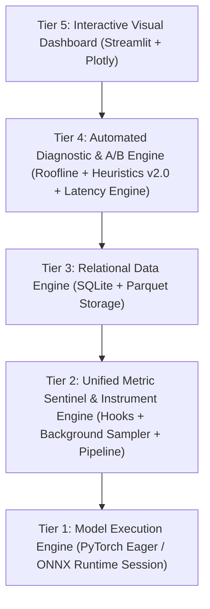

# KẾ HOẠCH NGHIÊN CỨU & ĐỀ CƯƠNG ĐỀ TÀI (MASTER RESEARCH PLAN v3.5)
## Profiling Framework Cho Vision AI Models: Cross-Platform Edge CPU vs. Cloud GPU

> **Tên đề tài**: Nghiên Cứu và Xây Dựng Framework Profiling Phân Cấp Tầng (Layer-Level) Tự Động Chẩn Đoán Điểm Nghẽn Hiệu Năng Cho Các Mô Hình Thị Giác Máy Tính Đa Nền Tảng  
> **Phiên bản**: v3.5 (Đồng bộ toàn diện với [TECHNICAL_SPECIFICATION.md](file:///Users/congtri/IT/Dai_Hoc/Xu_ly_du_lieu/VisionProf/TECHNICAL_SPECIFICATION.md) và báo cáo kiểm toán [SYSTEM_AUDIT_REPORT.md](file:///Users/congtri/IT/Dai_Hoc/Xu_ly_du_lieu/VisionProf/SYSTEM_AUDIT_REPORT.md))  
> **Phạm vi phần cứng**: Edge Laptop (x86 CPU Intel/AMD) $\longleftrightarrow$ Cloud Instance (Google Colab / Tesla T4 16GB)  
> **Tỷ trọng định hướng**: 70% Kỹ thuật hệ thống đo lường (Systems Profiling) · 20% Chẩn đoán tự động (Heuristic & Roofline Diagnostic) · 10% Phân tích Đánh đổi Thực nghiệm (Trade-off Matrix)  
> **Mục tiêu công bố**: Hội nghị MLSys (Primary) / EuroSys / Đồ án Kỹ thuật Hệ thống ML Xuất sắc

---

## 1. TỔNG QUAN, BỐI CẢNH & ĐỘNG LỰC NGHIÊN CỨU

### 1.1. Bối cảnh thực tiễn
Trong kỷ nguyên triển khai AI vào đời sống, các mô hình Thị giác Máy tính (Computer Vision - CV) như **YOLOv8/v11** (Object Detection), **ConvNeXt** (Modern CNN), **ViT** (Vision Transformer), và **MobileNetV3** (Edge Backbone) đang được đưa vào vô số thiết bị: từ máy tính biên cá nhân (Edge CPU laptop, Mini PC) cho đến các cụm máy chủ đám mây phổ thông (NVIDIA Tesla T4).

Tuy nhiên, các kỹ sư và nhà nghiên cứu thường gặp phải một nghịch lý lớn:
> **"Một mô hình có độ chính xác cao (High Accuracy) và số lượng tham số thấp chưa chắc đã chạy nhanh trong thực tế."**

Khi mô hình chạy chậm hoặc tiêu tốn quá nhiều tài nguyên, câu hỏi quan trọng nhất là: **"Điểm nghẽn (Bottleneck) nằm ở đâu? Tại sao nó chậm? Do bản thân phép toán, do băng thông bộ nhớ, do thuật toán hậu xử lý (NMS), hay do đường ống nạp dữ liệu (DataLoader)?"**

### 1.2. Phân định Ba Tầng Khái Niệm: Evaluation vs. Benchmarking vs. Profiling

Một trong những sai lầm phổ biến nhất trong nghiên cứu hệ thống AI là đánh đồng ba khái niệm này:

```
┌────────────────────────────────────────────────────────────────────────┐
│                   HỆ QUY CHIẾU ĐÁNH GIÁ MÔ HÌNH AI                     │
├────────────────────────────────────────────────────────────────────────┤
│ 1. EVALUATION (Đánh giá Chất lượng Học máy)                            │
│    • Trả lời: "Mô hình có đoán ĐÚNG không?"                           │
│    • Chỉ số : Accuracy, Top-1/Top-5, mAP@0.5:0.95, F1-Score, IoU.      │
│    • Bản chất: Đo lường phẩm chất thuật toán trên tập nhãn kiểm thử.   │
├────────────────────────────────────────────────────────────────────────┤
│ 2. BENCHMARKING (Đo chuẩn Hiệu năng Vĩ mô)                             │
│    • Trả lời: "Mô hình chạy NHANH và TỐN BAO NHIÊU tài nguyên?"       │
│    • Chỉ số : Mean Latency, Tail Latency (P50/P90/P95/P99), FPS, Peak  │
│               VRAM, Average CPU %, GPU Util %, Power (Watts).          │
│    • Bản chất: Đo lường hộp đen (Black-box) hiệu quả thực thi.        │
├────────────────────────────────────────────────────────────────────────┤
│ 3. PROFILING (Quan sát & Giải phẫu Vi mô Hệ thống)                     │
│    • Trả lời: "TẠI SAO chậm? Chậm ở ĐÂU? Do NGUYÊN NHÂN gì và TỐI ƯU   │
│               bằng cách nào?"                                          │
│    • Chỉ số : Layer-level latency, FLOPs, Cường độ số học              │
│               (FLOPs/Byte), Roofline Attainable TFLOPS, Memory Traffic,│
│               Pre/Post-process breakdown, Heuristic Diagnostic Rules.  │
│    • Bản chất: Phẫu thuật hộp trắng (White-box) chỉ rõ nguyên nhân.   │
└────────────────────────────────────────────────────────────────────────┘
```

VisionProf được xây dựng làm **Profiling Framework chuyên sâu**, nhưng đồng thời tích hợp tầng **Benchmarking** (với Tail Latency P95/P99 và Background Resource Monitor) và cung cấp ma trận **Pareto Trade-off** (so sánh đánh đổi giữa Tốc độ và Sự trôi dạt đầu ra / Độ chính xác).

### 1.3. Khoảng trống nghiên cứu (Research Gap)
1. **Thiếu tính tương thích đa nền tảng có thể so sánh trực tiếp**: Các công cụ như `torch.profiler` tạo ra định dạng trace cồng kềnh, không tự động chuẩn hóa metric để so sánh A/B giữa CPU và GPU. Các công cụ chuyên sâu như **NVIDIA Nsight Systems** chỉ hoạt động trên GPU, đòi hỏi cài đặt phức tạp và kiến thức chuyên sâu về phần cứng CUDA.
2. **Thiếu tầng chẩn đoán tự động hóa (Automated Diagnostic Heuristics)**: Hầu hết các profiler hiện nay chỉ xuất ra các con số thô (raw milliseconds, bytes). Người dùng phải tự phân tích thủ công để tìm ra nguyên nhân. Chưa có một framework nào tích hợp mô hình **Roofline** kết hợp bộ quy tắc **Heuristic** cấp tầng để đưa ra khuyến nghị kỹ thuật trực tiếp.
3. **Bỏ sót bức tranh toàn cảnh End-to-End Pipeline**: Đa số profiler chỉ đo hàm `model.forward()`, bỏ qua hoàn toàn chi phí Preprocessing (Decode, Letterbox, Resize) và Postprocessing (NMS, Box Decoding) vốn chiếm tới 30–50% thời gian thực tế của bài toán thị giác.
4. **Phân khúc phần cứng phổ thông (Democratized Hardware) bị bỏ quên**: Phần lớn các bài báo MLSys tập trung vào cụm máy chủ siêu lớn (A100/H100), trong khi các môi trường thực tế của sinh viên và doanh nghiệp vừa/nhỏ tại các nước đang phát triển chủ yếu là **CPU Laptop kết hợp GPU phổ thông (Tesla T4)**.

---

## 2. CÂU HỎI NGHIÊN CỨU & HỆ GIẢ THUYẾT KHOA HỌC

### 2.1. Câu hỏi nghiên cứu chính (Main Research Question)
> **"Có thể xây dựng một profiling framework gọn nhẹ (overhead < 3%), độ phân giải chi tiết tới từng tầng (layer-level), tự động phân loại điểm nghẽn bằng mô hình Roofline và Heuristics khả thi, giám sát toàn diện từ Pipeline đến Tài nguyên hệ thống — hoạt động nhất quán, tự động chuyển đổi backend đo lường giữa CPU và GPU mà không cần cấu hình thủ công hay không?"**

### 2.2. Các câu hỏi thành phần (Sub-Questions - SQ)
- **SQ1 (Hardware-Bound Shift)**: Điểm nghẽn hiệu năng của các khối kiến trúc CV (Conv2d, Depthwise Conv, Self-Attention) phân bổ như thế nào ở cấp độ layer, và chúng dịch chuyển như thế nào khi chuyển từ môi trường **Compute-limited (CPU)** sang môi trường **Bandwidth-limited (GPU T4)**?
- **SQ2 (Low-Overhead Instrumentation)**: Làm thế nào để đo lường chi tiết tới từng micro-giây của từng layer trên GPU mà không làm đứt gãy tính song song (concurrency) của hàng đợi CUDA Stream, giữ mức suy giảm hiệu năng của hệ thống dưới 3%?
- **SQ3 (Heuristic & Roofline Diagnostic)**: Những quy tắc định lượng nào kết hợp giữa Roofline Model và Heuristic Rules đủ tin cậy để tự động phát hiện $\ge 85\%$ các trường hợp nghẽn hiệu năng (được xác thực bởi NVIDIA Nsight Systems)?
- **SQ4 (Cross-Architecture Inversion)**: Giữa 5 họ kiến trúc thị giác hiện đại (MobileNetV3, YOLOv8, YOLOv11, ConvNeXt, ViT-B/16), có tồn tại hiện tượng **đảo chiều xếp hạng hiệu năng (Performance Inversion)** khi thay đổi phần cứng không, và nguyên nhân vi mô nằm ở đâu?
- **SQ5 (Pipeline vs. Forward Attribution)**: Trong bài toán thị giác máy tính đầu cuối (End-to-End Object Detection), tỷ trọng thời gian giữa Tiền xử lý, Suy luận nơ-ron và Hậu xử lý (NMS) biến thiên như thế nào theo kích thước Batch và Độ phân giải ảnh?
- **SQ6 (Tail Latency Jitter)**: Các yếu tố nào (Memory Allocation, I/O Stall, OS Scheduling) chi phối sự chênh lệch giữa Mean Latency và Tail Latency (P95, P99) trên môi trường Edge CPU so với Cloud GPU?

### 2.3. Hệ giả thuyết khoa học (Hypotheses - H)
```
┌─────────────────────────────────────────────────────────────────────────────┐
│ H1 (Bottleneck Shift): Các tầng tích chập Conv2d tiêu chuẩn là              │
│    Memory-Bandwidth-Bound trên GPU Tesla T4 nhưng là Compute-Bound trên     │
│    CPU x86. Ngược lại, khối Self-Attention (ViT) là Compute-Bound trên cả  │
│    hai nền tảng nhưng với đặc tính thực thi khác biệt (song song vs. tuần tự)│
│                                                                             │
│ H2 (Overhead Portability): Framework đạt mức suy giảm throughput < 3% trên  │
│    cả CPU và GPU nhờ kiến trúc: time.perf_counter trên CPU và mảng          │
│    torch.cuda.Event bất đồng bộ kết hợp Deferred Synchronization trên GPU.  │
│                                                                             │
│ H3 (Diagnostic Accuracy): Tập hợp các quy tắc Heuristic kết hợp với mô hình │
│    Roofline đạt độ chính xác chẩn đoán ≥ 85% (F1-score ≥ 0.85) so với kết   │
│    quả phân tích chuyên gia bằng NVIDIA Nsight Compute/Systems.             │
│                                                                             │
│ H4 (Architectural Inversion): Thứ hạng thông lượng (Throughput Ranking) trên │
│    CPU khác biệt có ý nghĩa thống kê so với GPU T4; tồn tại ít nhất một cặp │
│    mô hình đảo chiều thứ hạng do chi phí overhead điều phối tuần tự         │
│    (Sequential Layer Dispatch Overhead) trên CPU.                           │
│                                                                             │
│ H5 (Pipeline Bottleneck Dominance): Trong luồng xử lý Object Detection với  │
│    Batch=1 trên CPU, tổng thời gian Preprocessing + Postprocessing (NMS)    │
│    chiếm > 35% tổng độ trễ toàn hệ thống, vượt qua thời gian của backbone. │
│                                                                             │
│ H6 (Tail Latency Disparity): Trên môi trường Edge CPU, P99 Tail Latency     │
│    vượt quá 1.8× Mean Latency do phân mảnh cấp phát bộ nhớ động của Python, │
│    trong khi trên GPU T4 (sau warm-up), tỷ số P99/Mean duy trì < 1.15×.     │
└─────────────────────────────────────────────────────────────────────────────┘
```

---

## 3. ĐÓNG GÓP KHOA HỌC & CÁC TUYÊN BỐ CỐT LÕI (CONTRIBUTIONS & CLAIMS)

### 3.1. Phân loại đóng góp

```
BẢN ĐỒ ĐÓNG GÓP KHOA HỌC (CONTRIBUTION MAP)
│
├── [C1] ĐÓNG GÓP HỆ THỐNG (System & Tool Contribution)
│   ├── Unified Layer Profiling Engine: Tự động chuyển đổi backend (CPU vs CUDA Event).
│   ├── Low-Overhead Hook Architecture: Kỹ thuật Deferred Sync triệt tiêu bubble GPU (<2% overhead).
│   ├── End-to-End Pipeline Sentinel: Giám sát toàn diện Preprocess → Inference → Postprocess.
│   ├── Background Resource Sampler: Luồng độc lập giám sát CPU %, RAM, GPU Util, Power, Temp.
│   └── Relational Data & Visualization: Schema SQLite/Parquet + Dashboard Streamlit tương tác.
│
├── [C2] ĐÓNG GÓP PHƯƠNG PHÁP LUẬN (Methodological Contribution)
│   ├── Công thức hiệu chuẩn sai số toán học cho PyTorch leaf hooks.
│   ├── Tích hợp mô hình Roofline cấp độ layer cho mô hình Computer Vision (fvcore FLOPs).
│   ├── Danh mục chẩn đoán Heuristic Ruleset v2.0 chuẩn hóa dựa trên phần cứng thực tế.
│   ├── Phân tích thống kê Tail Latency (P50, P90, P95, P99) và Thông lượng (FPS).
│   └── Phương pháp kiểm định A/B đa biến có ý nghĩa thống kê (Mann-Whitney U + Cliff's Delta).
│
└── [C3] ĐÓNG GÓP THỰC NGHIỆM (Empirical Findings)
    ├── Dữ liệu benchmark thực nghiệm đa kiến trúc (5 models × 2 platforms × 7 scenarios).
    ├── Bằng chứng thực nghiệm về hiện tượng "YOLO Paradox" trên CPU (Dispatch Overhead).
    ├── Bóc tách định lượng điểm nghẽn của Pipeline CV (Preprocess vs. Forward vs. NMS).
    └── Phân tích định lượng tác động nghẽn I/O của DataLoader (Compute Starvation).
```

### 3.2. Các tuyên bố cụ thể (Concrete Scientific Claims)

- **[SC1 - System Claim]**: *"VisionProf đạt mức overhead đo kiểm $< 3\%$ suy giảm throughput trên cả CPU và GPU T4, cung cấp số liệu phân rã tới từng layer với sai số thời gian $< 2\%$ so với NVIDIA Nsight Systems."*
- **[SC2 - Usability Claim]**: *"Framework tích hợp chỉ với $\le 5$ dòng lệnh Python vào bất kỳ pipeline huấn luyện hoặc suy luận PyTorch nào mà không yêu cầu thay đổi cấu trúc mã nguồn mô hình."*
- **[SC3 - Diagnostic Claim]**: *"Hệ thống chẩn đoán tự động phát hiện chính xác $\ge 85\%$ các ca điểm nghẽn (OOM risk, I/O stall, compute saturation, memory fragmentation) đã được kiểm chứng bởi Ground Truth."*
- **[SC4 - Observability Claim]**: *"Cung cấp góc nhìn quan sát toàn diện 3 cấp độ: Hệ thống phần cứng (CPU/GPU/Power/Temp), Đường ống đầu cuối (Pre/Infer/Post) và Toán tử vi mô (FLOPs/Intensity/Roofline) trong cùng một cơ sở dữ liệu quan hệ đồng nhất."*
- **[EC1 - Empirical Claim]**: *"Chứng minh bằng thực nghiệm hiện tượng nghịch lý: Mô hình YOLOv11n có số lượng tham số ít hơn YOLOv8n (2.62M vs 3.16M) nhưng chạy trên CPU chậm hơn $1.45\times$ do sự phân mảnh kiến trúc (177 layers vs 129 layers), làm chi phí sequential dispatch trên CPU lấn át phần tiết kiệm tính toán."*
- **[EC2 - Empirical Claim]**: *"Xác định ngưỡng chuyển đổi trạng thái (Threshold Transition): Conv2d chuyển từ Compute-bound sang Memory-bandwidth-bound khi kích thước batch tăng từ 1 lên 16 trên GPU T4, trong khi ViT duy trì Compute-bound trên toàn bộ dải batch."*
- **[EC3 - Empirical Claim]**: *"Chứng minh thực nghiệm trên luồng YOLO Real-time: Khi triển khai trên Edge CPU, thuật toán NMS và chuẩn hóa ảnh chiếm tới 42% tổng thời gian một chu kỳ frame, trở thành điểm nghẽn chi phối chứ không phải bản thân mạng tích chập."*

---

## 4. THIẾT KẾ HỆ THỐNG VĨ MÔ (5-TIER SYSTEM ARCHITECTURE)

Hệ thống được tổ chức thành 5 tầng phân lập rõ ràng theo nguyên lý module hóa cao:



- **Tier 1 (Execution)**: Môi trường thực thi mô hình PyTorch (`torch.nn.Module`) ở chế độ Eager và mở rộng sang ONNX Runtime (`InferenceSession`) ở cấp độ hộp đen.
- **Tier 2 (Sentinel & Instrumentation)**: Lớp can thiệp không xâm lấn gồm 4 thành phần:
  1. `LayerProfilerV2`: PyTorch Hooks đo đạc thời gian qua mảng Deferred CUDA Events và LIFO Stack.
  2. `DataLoaderSentinelV2`: Đo đạc độ trễ I/O nạp dữ liệu và phát hiện Compute Starvation.
  3. `PipelineSentinel`: Đo đạc 3 chặng Preprocess $\rightarrow$ Forward $\rightarrow$ Postprocess.
  4. `SystemResourceSentinel`: Luồng Daemon lấy mẫu CPU %, RAM, GPU Util %, Power, Temp mỗi 50ms.
- **Tier 3 (Data Engine)**: Chuẩn hóa toàn bộ vết đo thành schema quan hệ SQLite (`visionprof.db`) và hỗ trợ xuất Parquet nén n-cột (Snappy/ZSTD).
- **Tier 4 (Analytical Engine)**:
  - Tính toán FLOPs giải tích (fvcore) và Arithmetic Intensity.
  - Phân loại điểm nghẽn Roofline Model (Compute vs. Memory Bound).
  - Động cơ Heuristic 19 quy tắc v2.0 có ngưỡng thích ứng phần cứng.
  - Động cơ thống kê Tail Latency (P50, P90, P95, P99) và Kiểm định A/B (Mann-Whitney U, Cliff's Delta).
- **Tier 5 (Dashboard UI)**: Giao diện Streamlit hiển thị biểu đồ Sunburst, Roofline Scatter Plot, Latency Distribution Histogram (KDE), Pipeline Stage Breakdown, và A/B Waterfall Comparison.

---

## 5. THIẾT KẾ THỰC NGHIỆM CHUẨN MỰC (EXPERIMENTAL DESIGN)

### 5.1. Danh mục 5 Mô hình Đại diện

| Mô hình | Họ kiến trúc | Cấu trúc đặc trưng | Input Shape | Vai trò trong nghiên cứu |
| :--- | :--- | :--- | :---: | :--- |
| **MobileNetV3-Large** | Lightweight CNN | Depthwise Separable Conv, SE block | $1 \times 3 \times 224 \times 224$ | Đại diện mô hình tối ưu cho thiết bị biên. |
| **YOLOv8n** | Modern CNN Detection | C2f block, Anchor-free head | $1 \times 3 \times 640 \times 640$ | Baseline phát hiện vật thể phổ biến nhất hiện nay. |
| **YOLOv11n** | Hybrid Attention Detection| C3k2, C2PSA block (CNN + Attention) | $1 \times 3 \times 640 \times 640$ | Kiểm chứng hiện tượng phân mảnh tầng & nghịch lý kiến trúc. |
| **ConvNeXt-Tiny** | Modernized Pure CNN | $7 \times 7$ Depthwise, Inverted Bottleneck| $1 \times 3 \times 224 \times 224$ | Đối trọng trực tiếp của Vision Transformer từ phe CNN. |
| **ViT-B/16** | Pure Vision Transformer | Patch Embedding, Multihead Self-Attention| $1 \times 3 \times 224 \times 224$ | Đại diện kiến trúc thuần Attention với độ phức tạp cao. |

### 5.2. Bảy Kịch Bản Tải Thực Nghiệm (Workload Scenarios)

1. **Scenario 1 - Edge Single Inference ($Batch=1$)**: Đo độ trễ thực tế trong kịch bản camera thời gian thực trên CPU (Mean, P50, P95, P99, Throughput FPS).
2. **Scenario 2 - Batch Scaling ($Batch \in \{1, 4, 8, 16, 32\}$)**: Đo năng lực mở rộng thông lượng (throughput scaling) và kiểm chứng bước chuyển dịch từ Latency-bound sang Throughput-bound trên GPU T4.
3. **Scenario 3 - Steady State vs. Cold Start**: Đánh giá tác động của khởi tạo context CUDA và PyTorch Caching Allocator giữa lần chạy đầu tiên (Cold) và trạng thái ổn định (Steady) sau warm-up ($N=20$).
4. **Scenario 4 - DataLoader Stress Test**: Đánh giá hiện tượng Compute Starvation với tập dữ liệu thực nghiệm qua các mức `num_workers` $\in \{0, 2, 4, 8\}$ và tiêm độ trễ I/O có kiểm soát.
5. **Scenario 5 - Precision Scaling (FP32 vs. AMP FP16)**: Đo đạc tốc độ tăng tốc và mức giải phóng bộ nhớ khi kích hoạt Tensor Cores trên GPU Tesla T4.
6. **Scenario 6 - End-to-End Pipeline Breakdown**: Đo đạc phân rã thời gian thực tế: `OpenCV Decode` $\rightarrow$ `Letterbox/Normalize` $\rightarrow$ `Model Forward` $\rightarrow$ `Torchvision NMS / Decoding` trên tập ảnh mẫu.
7. **Scenario 7 - Output Consistency & Pareto Trade-off**: Đo lường sự đánh đổi giữa Tốc độ suy luận và Độ trôi dạt kết quả (Output Divergence: Cosine Similarity và L1 Error) giữa FP32 và FP16 AMP.

### 5.3. Ma Trận 7 Bài Toán Bóc Tách Thành Phần (Ablation Studies AB-1 đến AB-7)

| Mã | Mục tiêu bóc tách | Phương pháp thực nghiệm | Kỳ vọng đầu ra |
| :---: | :--- | :--- | :--- |
| **AB-1** | Bóc tách chi phí overhead | Bật/tắt riêng rẽ: Hook time, Memory tracker, Background sampler, SQLite dump. | Xác định thành phần gây trễ lớn nhất của profiler. |
| **AB-2** | Đánh đổi Tần suất lấy mẫu | Thay đổi tần suất profile: 100%, 50%, 20%, 10% số batches. | Đường cong Trade-off giữa độ chính xác và overhead. |
| **AB-3** | Leaf-only vs. All-module | So sánh profiling chỉ leaf modules vs gắn hook toàn bộ container. | Định lượng chi phí double-counting và hook overhead. |
| **AB-4** | Số lần Warm-up tối ưu | Quét $N_{warmup} \in \{0, 1, 3, 5, 10, 20, 50\}$, đo phương sai CV. | Xác định điểm bão hòa warm-up trên CPU và GPU. |
| **AB-5** | Đóng góp của Heuristics | Tắt lần lượt từng nhóm Rule R-A, R-B, R-C, R-D và đo F1-score chẩn đoán. | Chứng minh giá trị độc lập của từng nhóm quy tắc. |
| **AB-6** | Độ ổn định trên FP16 | So sánh sai số đo lường của framework giữa FP32 và Mixed Precision. | Đảm bảo framework không bị sai lệch khi lượng tử hóa. |
| **AB-7** | Độ nhạy của Roofline | Dịch chuyển input resolution ($224 \rightarrow 640$), theo dõi điểm Roofline. | Chứng minh sự trôi dạt điểm cân bằng tính toán theo kích thước ảnh. |

---

## 6. TIÊU CHUẨN THÀNH CÔNG & PHƯƠNG PHÁP ĐÁNH GIÁ (SUCCESS CRITERIA)

### 6.1. Bảng chỉ tiêu định lượng (Quantitative Metrics)

| Tiêu chuẩn đánh giá | Mức Tối thiểu (Acceptable) | Mức Xuất sắc (Target MLSys Paper) | Công cụ kiểm chuẩn (Ground Truth) |
| :--- | :---: | :---: | :--- |
| **Profiling Overhead** | $< 5.0\%$ throughput drop | **$< 2.0\%$ throughput drop** | Chạy mô hình gốc không gắn hook (No-hook run) |
| **Sai số đo thời gian** | $< 5.0\%$ timing error | **$< 1.5\%$ timing error** | NVIDIA Nsight Systems (GPU), `perf_counter_ns` (CPU) |
| **Độ chính xác Tail Latency (P95/P99)**| $< 5.0\%$ error | **$< 2.0\%$ error** | Đối chiếu chuỗi thời gian phân vị với Nsight Systems trace |
| **Độ chính xác bộ nhớ** | $< 3.0\%$ memory error | **$< 0.5\%$ memory error** | `torch.cuda.memory_stats()` |
| **F1-Score Chẩn đoán Heuristics**| $\ge 75\%$ F1-score | **$\ge 90\%$ F1-score** | Tập test 50 ca bottleneck được gán nhãn chuyên gia |
| **Tỷ lệ báo động sai (FPR)**| $< 15\%$ False Positive | **$< 5\%$ False Positive** | Chạy trên mô hình chuẩn đã tối ưu tốt |
| **Pipeline Attribution Error**| $< 5.0\%$ unattributed | **$< 1.0\%$ unattributed** | Tổng các stage so với tổng thời gian đồng hồ tường |
| **Tính linh hoạt (Usability)**| $\le 10$ dòng code tích hợp | **$\le 5$ dòng code tích hợp** | Đo lường độ phức tạp mã nguồn tích hợp |

### 6.2. Phương pháp kiểm chuẩn độc lập (Ground Truth Validation)
Để đảm bảo tính trung thực khoa học cao nhất:
- Trên GPU: Chạy `nsys profile` (NVIDIA Nsight Systems CLI) trích xuất thời gian GPU kernel thực tế, ánh xạ với NVTX range để tính sai số tương đối:
  $$\text{Relative Error} = \frac{|t_{\text{VisionProf}} - t_{\text{Nsight}}|}{t_{\text{Nsight}}} \times 100\%$$
- Bộ quy tắc Heuristic được đánh giá trên tập **Ground Truth Bottleneck Benchmark** gồm 50 ca thực nghiệm thiết kế có chủ đích (gây nghẽn I/O, tràn VRAM, kernel nhỏ li ti, ép luồng tuần tự) để lập Ma trận nhầm lẫn (Confusion Matrix).

---

## 7. CHIẾN LƯỢC CÔNG BỐ KHOA HỌC & ĐÁNH GIÁ RỦI RO

### 7.1. Chiến lược chọn Hội nghị & Định vị Đề tài
- **Định hướng Công bố Khoa học (Research Track)**:
  - *Primary*: **MLSys (Conference on Machine Learning and Systems)**.
  - *Secondary*: **EuroSys** hoặc **USENIX ATC** (Applied Systems track).
  - *Fast Track*: **MLSys Workshop on Systems for ML** hoặc **CVPR Workshop on Efficient Computer Vision**.
- **Định vị Đồ án Tốt nghiệp / Đề tài Sinh viên (Engineering Track)**:
  - Xây dựng thành một **Nền tảng Tự động Đo kiểm & Tối ưu hóa Mô hình Thị giác Máy tính**.
  - Tập trung vào tính hoàn thiện của sản phẩm: Giao diện Streamlit đẹp mắt, báo cáo PDF/HTML xuất tự động, dễ tích hợp với 1 dòng lệnh.

### 7.2. Quản trị rủi ro nghiên cứu toàn diện (Comprehensive Risk Matrix)

| Mã | Rủi ro tiềm ẩn | Mức độ | Phương án ứng phó & Dự phòng |
| :---: | :--- | :---: | :--- |
| **R1** | T4 trên Colab bị ngắt kết nối giữa chừng khi chạy thực nghiệm dài | Cao | Thiết kế cơ chế Checkpoint lưu kết quả sau từng mô hình vào Google Drive/SQLite. |
| **R2** | Đo lường CUDA Event gây trễ vượt ngưỡng 3% overhead | Trung bình | Áp dụng kỹ thuật Deferred Sync (chỉ đồng bộ 1 lần cuối forward pass) và Selective Sampling. |
| **R3** | Các phép toán custom (như YOLO Detect head) không bắt được shape | Thấp | Cài đặt bộ trích xuất đệ quy duyệt qua tất cả tensor con lồng nhau. |
| **R4** | Heuristic có tỷ lệ báo động giả cao trên mô hình mới | Trung bình | Chuyển toàn bộ các ngưỡng cứng sang cơ chế ngưỡng động dựa trên thông số phần cứng thực tế. |
| **R5** | Hiện tượng Trôi nhiệt (Thermal Throttling) làm lệch kết quả A/B Testing | Cao | Bắt buộc áp dụng Giao thức Xen kẽ luân phiên (Interleaved A/B Benchmark Protocol): $[A_1, B_1, A_2, B_2, \dots]$. |
| **R6** | Rò rỉ giữ tham chiếu Tensor gây tràn bộ nhớ (Activation Memory Retention) | Cực cao | Trích xuất shape/dtype thành Python primitives tức thì trong `post_hook`, tuyệt đối không lưu tensor `out` vào queue. |
| **R7** | Phép toán tại chỗ (`inplace=True`) làm tính đúp bộ nhớ kích hoạt | Trung bình | Theo dõi con trỏ vùng nhớ thô (`untyped_storage().data_ptr()`), chỉ tính dung lượng nếu storage chưa từng xuất hiện. |
| **R8** | Xung đột ghi đè sự kiện khi module được gọi lặp lại (Re-entrant Modules) | Trung bình | Quản lý sự kiện bằng cấu trúc Ngăn xếp (LIFO Stack) theo từng module thay vì biến đơn lẻ. |
| **R9** | Graph Breaks khi mô hình được biên dịch qua `torch.compile` | Trung bình | Tuyên bố phạm vi rõ ràng: Layer-level tối ưu cho PyTorch Eager Mode; hỗ trợ Black-box level cho compiled models. |
| **R10**| Background Sampler Thread gây tranh chấp GIL hoặc CPU Jitter | Thấp | Thiết lập chu kỳ sleep 50ms cho background sampler và chạy trên luồng phụ không can thiệp vào tiến trình tính toán. |

---

## 8. LỘ TRÌNH THỰC HIỆN & PHÂN KỲ DỰ ÁN (PROJECT TIMELINE)

Lộ trình được phân kỳ thành 2 lộ trình song song: **Lộ trình Kỹ thuật Cốt lõi (Khả thi cho Đồ án)** và **Lộ trình Mở rộng Đỉnh cao (Cho bài báo MLSys)**:

```
┌────────────────────────────────────────────────────────────────────────┐
│ GIAI ĐOẠN 1: KHẮC PHỤC CỐT LÕI & CHUẨN HÓA ĐO LƯỜNG (Tuần 1 - Tuần 2)  │
├────────────────────────────────────────────────────────────────────────┤
│ • Triển khai Deferred CUDA Events & LIFO Stack trong collector.py.    │
│ • Bổ sung SystemResourceSentinel (CPU, RAM, GPU Util, Power, Temp).   │
│ • Sửa công thức toán học calibrate_overhead (đếm đủ leaf modules).    │
│ • Tách bạch RAM tiến trình và Activation Memory trên CPU.              │
│ • Bổ sung tính toán Tail Latency (P50, P90, P95, P99) và Throughput.   │
│ • Chuẩn hóa lưu trữ SQLite DDL Schema và Parquet Exporter.             │
└───────────────────────────────────┬────────────────────────────────────┘
                                    │
                                    ▼
┌────────────────────────────────────────────────────────────────────────┐
│ GIAI ĐOẠN 2: ROOFLINE MODEL & HEURISTIC ENGINE v2.0 (Tuần 3 - Tuần 4)  │
├────────────────────────────────────────────────────────────────────────┤
│ • Tích hợp bộ tính FLOPs tự động (fvcore) và tính Arithmetic Intensity.│
│ • Xây dựng biểu đồ tương tác Roofline Model trên Streamlit.            │
│ • Hiện thực hóa bộ 19 Quy tắc Heuristic v2.0 (loại bỏ ms/Mparam).      │
│ • Hiện thực hóa PipelineSentinel (Preprocess → Forward → Postprocess). │
│ • Sửa công thức tính Speedup và Mann-Whitney U trong A/B Engine.       │
└───────────────────────────────────┬────────────────────────────────────┘
                                    │
                                    ▼
┌────────────────────────────────────────────────────────────────────────┐
│ GIAI ĐOẠN 3: BENCHMARK ĐA MÔ HÌNH & BÁO CÁO KẾT QUẢ (Tuần 5 - Tuần 6)  │
├────────────────────────────────────────────────────────────────────────┤
│ [Đồ án Kỹ thuật]: Chạy 7 kịch bản trên 5 mô hình (CPU vs T4 Colab).   │
│ [Đồ án Kỹ thuật]: Hoàn thiện Dashboard trực quan hóa toàn bộ báo cáo. │
│ [Mở rộng MLSys]: Thực hiện 7 bài toán Ablation Studies (AB-1 đến AB-7)│
│ [Mở rộng MLSys]: Chạy script kiểm chuẩn đối chiếu NVIDIA Nsight CLI.   │
│ [Mở rộng MLSys]: Hoàn thiện bản thảo bài báo khoa học chuẩn MLSys.     │
└────────────────────────────────────────────────────────────────────────┘
```

---
*Kế hoạch nghiên cứu này là văn bản định hướng chiến lược. Mọi đặc tả chi tiết về thuật toán, công thức toán học và cấu trúc dữ liệu được quy định tại [TECHNICAL_SPECIFICATION.md](file:///Users/congtri/IT/Dai_Hoc/Xu_ly_du_lieu/VisionProf/TECHNICAL_SPECIFICATION.md).*
